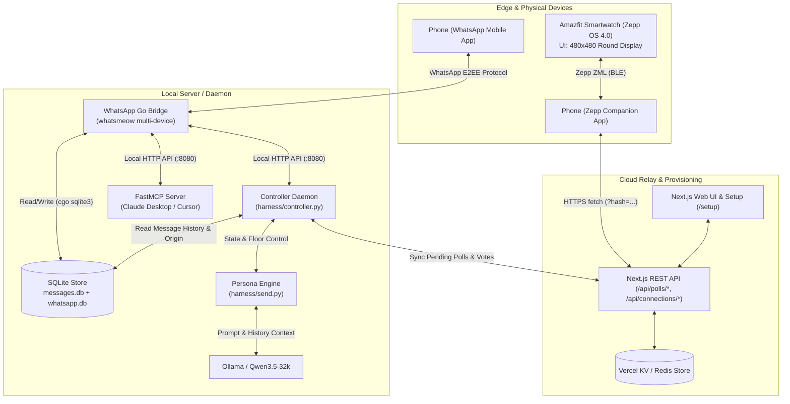
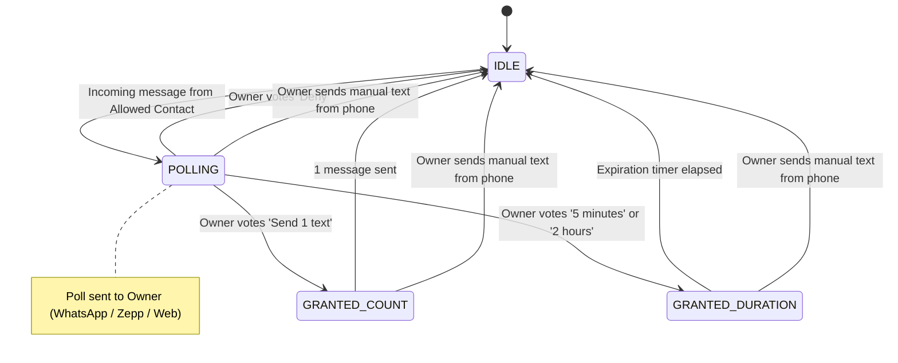
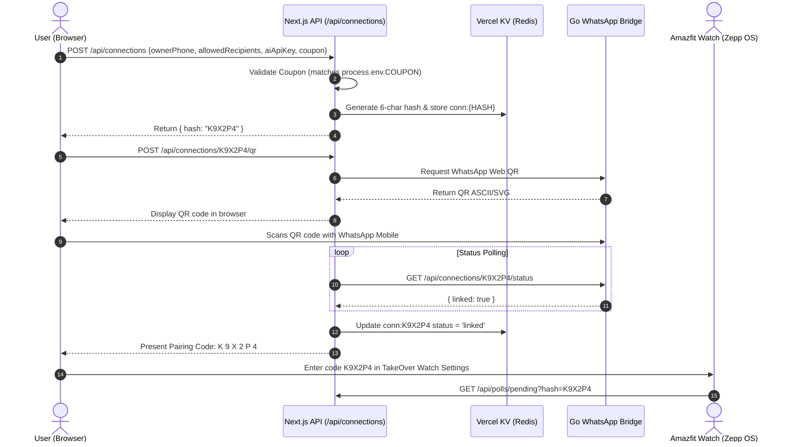

# System Architecture & Technical Specification

This document details the architectural design, communication protocols, state management, and data flow of the **WhatsApp AI & TakeOver System**.

---

## 1. High-Level System Architecture

The system operates across three tiers:
1. **Edge & Hardware Tier**: Amazfit Smartwatch running Zepp OS 4.0 and the user's mobile device running WhatsApp & the Zepp App companion.
2. **Local Processing Tier**: Go Bridge (connected via WhatsApp Web Multi-Device protocol), local SQLite store, Python TakeOver Controller, and Ollama local LLM inference engine.
3. **Cloud & Web Relay Tier**: Next.js App Router deployed with Vercel KV (Redis) enabling remote dashboard access, connection provisioning, and cross-device approval synchronization.



---

## 2. Core Subsystems

### 2.1 WhatsApp Go Bridge (`whatsapp-bridge/`)
Built with Go and [whatsmeow](https://github.com/tulir/whatsmeow), this daemon acts as a full WhatsApp Web client.

* **Authentication**: Multi-device QR pairing with session tokens persisted in `store/whatsapp.db`.
* **Message Ingestion & Classification**:
  * Decrypts incoming messages and stores them in SQLite (`store/messages.db`).
  * Classifies message `origin`:
    * `"remote"`: Incoming message from an external contact.
    * `"phone"`: Outgoing message originated manually from the owner's phone (`IsFromMe = true`).
* **Native Poll Engine**:
  * Emits interactive native WhatsApp polls using `whatsmeow.Client.BuildPollCreation()`.
  * Intercepts `events.Message` containing `PollUpdateMessage`, decrypts vote selections via `client.DecryptPollVote()`, maps SHA-256 option hashes back to text, and writes them to the `poll_votes` table.
* **HTTP Microservice (`:8080`)**:
  * `POST /api/send`: Send standard text messages.
  * `POST /api/send-poll`: Send interactive polls.
  * `POST /api/send-file` & `/api/send-audio`: Dispatch media and voice notes.
  * `POST /api/download`: Decrypt and download media files locally.

---

### 2.2 TakeOver Controller & State Machine (`harness/controller.py`)

The controller acts as the orchestrator. It runs an event loop evaluating contact chats:



#### State Transition Logic:
1. **Seeding (`max_rowid`)**: On startup, reads the latest `rowid` for each contact in `ALLOWED_RECIPIENTS` to prevent replaying stale messages.
2. **Poll Dispatch**: When an unreplied message arrives and state is `idle`, dispatches a poll to `OWNER_PHONE`.
3. **Vote Resolution**: Checks `poll_votes` in SQLite and/or polls the Cloud Relay.
4. **Autonomous Execution**:
   * If grant is active and the contact has the floor, invokes `send_reply()`.
   * Increments message counts / tracks expiration timestamps.
5. **Human Override Safety**:
   * If any message in the target chat has `origin == "phone"`, the grant is immediately aborted.
   * Sends a push confirmation to the owner: `"You just texted {contact}: Closing request"`.

---

### 2.3 Persona Generator & Thinking Heuristics (`harness/send.py`)

The persona engine generates authentic replies by prompting the model with conversation history:

#### Prompting Philosophy
* The prompt extracts messages marked `From: Me` to mirror the owner's exact writing style (slang, brevity, emoji frequency, capitalization, punctuation).
* Explicitly forbids the LLM from mirroring the other person's tone.
* Prohibits generic AI disclosures, markdown, and self-monologuing.

#### Adaptive Thinking Mode
```
                             Incoming Message
                                    │
                                    ▼
                     Count words in last incoming text
                                    │
                  ┌─────────────────┴─────────────────┐
                  ▼                                   ▼
             <= 5 Words                           > 5 Words
                  │                                   │
                  ▼                                   ▼
          [Fast Mode]                         [Thinking Mode]
      • Limit: 8 messages                  • Limit: 20 messages
      • Ollama think: false                • Ollama think: true
      • Low-latency one-liner              • Deep contextual reasoning
```

#### Floor Control Rules
* `contact_has_floor()`: Verifies that the most recent message is from the contact before answering.
* `count_recent_me(history, window=5)`: Ensures the AI does not monopolize the chat (prevents sending consecutive unprompted messages).

---

### 2.4 Connection Provisioning & Pairing System (`web/app/setup/`)



#### Key Elements:
* **The 3 Key Values**: `OWNER_PHONE`, `ALLOWED_RECIPIENTS`, `AI_API_KEY`.
* **Coupon Gating**: Access is guarded by `COUPON` in the environment. Mismatched coupons return HTTP 403 with `Contact wa.me/+917060410033 to get one.`
* **Unambiguous Base-32 Hash Algorithm**:
  * Generates random 6-character tokens omitting visual duplicates (`0`, `O`, `1`, `I`):
  * Alphabet: `ABCDEFGHJKLMNPQRSTUVWXYZ23456789`
  * Keys stored in KV: `conn:{HASH}` and indexed in the `connections` sorted set.

---

### 2.5 Zepp OS Smartwatch Architecture (`zepp/`)

Built for **Amazfit T-Rex 3** (Zepp OS 4.0, 480x480 round AMOLED display):

* **Touch Geometry**: Symmetrically aligned buttons with radius styling designed specifically for circular watch bezels ([`zepp/page/index.page.r.layout.js`](file:///Users/nikhilmundhra/Documents/Github/external/whatsapp-mcp/zepp/page/index.page.r.layout.js)).
* **Color Psychology**:
  * 🔵 `Send 1 text` (`#2b6cb0` - Standard blue)
  * 🔵 `5 minutes` (`#2b6cb0` - Standard blue)
  * 🟢 `2 hours` (`#38a169` - Forest green for extended autonomy)
  * 🔴 `Deny` (`#c53030` - Crimson red for denial)

---

### 2.6 Cloud Relay & Web Control Panel (`web/`)

* Built on **Next.js 14** with `@vercel/kv` (Redis).
* **Key Schemas**:
  * `conn:<hash>`: Connection configuration and link status.
  * `poll:<id>`: Hash containing poll JSON metadata.
  * `pending`: Set containing IDs of currently active, unanswered polls.
  * `polls`: Sorted set ordered by creation timestamp (`createdAt`).
* **Endpoints**:
  * `POST /api/connections`: Validate coupon & register connection parameters.
  * `POST /api/connections/:hash/qr`: Request QR pairing code from bridge.
  * `GET /api/connections/:hash/status`: Check WhatsApp Web authentication state.
  * `POST /api/connections/:hash/otp/send`: Generate and send 6-digit WhatsApp OTP to owner's phone.
  * `POST /api/connections/:hash/otp/verify`: Validate WhatsApp OTP and mint authenticated session token.
  * `POST /api/auth/otp/send`: Generic OTP dispatch endpoint.
  * `POST /api/auth/otp/verify`: Generic OTP verification endpoint.
  * `POST /api/auth/session/verify`: Check validity of active session token.
  * `POST /api/auth/logout`: Revoke active session token.
  * `GET /api/polls`: List all historical and pending polls.
  * `GET /api/polls/pending`: Retrieve pending poll scoped to a pairing hash.
  * `POST /api/polls/[id]`: Record a vote from the Web UI or smartwatch.
  * `POST /api/polls/[id]/expire`: Mark poll as expired.

---

## 3. Database Schemas (SQLite & Vercel KV)

### SQLite (`whatsapp-bridge/store/messages.db`)
```sql
CREATE TABLE IF NOT EXISTS chats (
    jid TEXT PRIMARY KEY,
    name TEXT,
    last_message_time TIMESTAMP
);

CREATE TABLE IF NOT EXISTS messages (
    id TEXT,
    chat_jid TEXT,
    sender TEXT,
    content TEXT,
    replied_to TEXT,
    timestamp TIMESTAMP,
    is_from_me BOOLEAN,
    media_type TEXT,
    filename TEXT,
    url TEXT,
    media_key BLOB,
    file_sha256 BLOB,
    file_enc_sha256 BLOB,
    file_length INTEGER,
    origin TEXT, -- 'remote' | 'phone'
    PRIMARY KEY (id, chat_jid),
    FOREIGN KEY (chat_jid) REFERENCES chats(jid)
);

CREATE TABLE IF NOT EXISTS poll_votes (
    poll_msg_id TEXT,
    voter_jid TEXT,
    question TEXT,
    selected_options TEXT,
    timestamp TIMESTAMP,
    PRIMARY KEY (poll_msg_id, voter_jid)
);
```

### Vercel KV (Redis)
```redis
# Connection Hash
HSET conn:K9X2P4 data '{"hash":"K9X2P4","ownerPhone":"917060410033","allowedRecipients":["917893472546"],"status":"linked","createdAt":1723760000000}'
ZADD connections 1723760000000 K9X2P4

# OTP Challenge (10 min TTL)
SETEX otp:K9X2P4 600 '{"hash":"K9X2P4","code":"584920","ownerPhone":"+917060410033","attempts":0,"expiresAt":1723760600000}'

# Authenticated Session Token (30 days TTL)
SETEX session:a8f9e2...b410 2592000 '{"token":"a8f9e2...b410","hash":"K9X2P4","createdAt":1723760000000,"expiresAt":1726352000000}'

# Poll Entry
HSET poll:msg_12345 data '{"id":"msg_12345","hash":"K9X2P4","contactDisplay":"Alex","question":"Take over?","options":["Send 1 text","5 minutes","2 hours","Deny"],"status":"pending","createdAt":1723760100000}'
SADD pending msg_12345
ZADD polls 1723760100000 msg_12345
```

---

## 4. Security & Isolation Matrix

| Threat Vector | Mitigation Strategy |
| :--- | :--- |
| **Unauthorized Dashboard Login** | 2-Factor Authentication required: entering connection hash triggers a 6-digit WhatsApp OTP sent directly to the owner's phone. Maximum 5 attempts and 10-minute validity. |
| **Unauthorized messaging** | Hard whitelist check in `controller.py` and `send.py` (`ALLOWED_RECIPIENTS`). |
| **Runaway AI loops** | Floor control verifies last sender $\neq$ Me; count limits enforce 1-reply bounds. |
| **Accidental autonomous takeover** | Owner must explicitly click a poll option; default state is `idle`. |
| **Human takeover conflict** | Automatic hardware override whenever `origin == "phone"` is observed. |
| **Unauthenticated watch access** | Watch queries are scoped strictly by valid, verified 6-character connection hashes. |
| **Data exfiltration** | Local SQLite storage; LLM runs 100% locally on Ollama without external API calls. |
