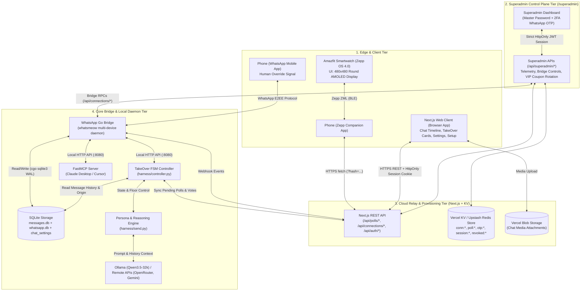
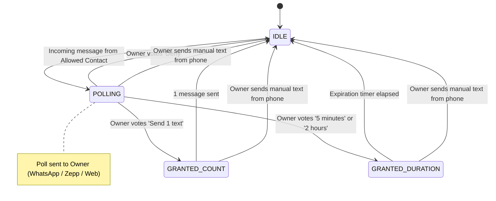
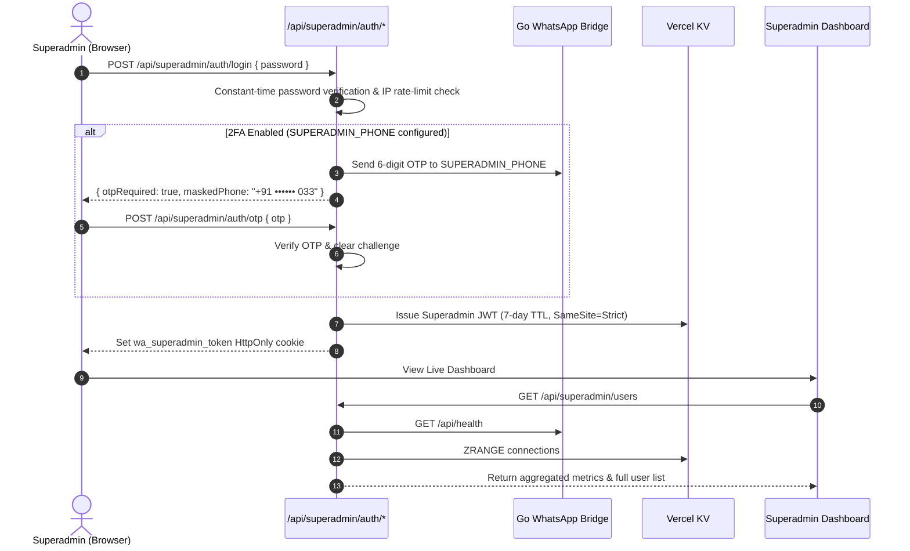

# System Architecture & Technical Specification

This document details the architectural design, communication protocols, state management, and data flow of the **WhatsApp AI & TakeOver System**.

---

## 1. High-Level System Architecture

The system operates across four primary tiers:
1. **Edge & Client Tier**:
   - **Next.js Web Client (Browser App / React SPA)**: Full WhatsApp-like web interface providing live chat timeline, interactive TakeOver cards, per-contact relationship settings, connection switcher, and onboarding wizard.
   - **Amazfit Smartwatch (Zepp OS 4.0)**: Low-power tactile wearable interface for the Amazfit T-Rex 3 (480x480 round AMOLED display) running the TakeOver watch app.
   - **Phone Companion & WhatsApp Mobile App**: The user's mobile device acting as both a BLE companion relay for the watch and the ground-truth human override channel.
2. **Superadmin Control Plane Tier (`/superadmin`)**:
   - Master administrative dashboard with 2-Factor Authentication (Master password + WhatsApp OTP challenge to `SUPERADMIN_PHONE`).
   - Global multi-tenant telemetry, storage footprint tracking, message volume aggregation, remote bridge lifecycle management (reconnect, disconnect, delete), and dynamic VIP coupon generation.
3. **Cloud Relay & Provisioning Tier**:
   - Next.js 14 App Router deployed with Vercel KV (Redis) and Vercel Blob, providing REST APIs for cross-device poll synchronization, connection provisioning, and media storage.
4. **Local Core & Bridge Tier**:
   - Multi-tenant Go Bridge (connected via WhatsApp Web Multi-Device protocol), local SQLite store (`messages.db`, `whatsapp.db`, `chat_settings`), Python TakeOver Controller (`harness/controller.py`), Persona Engine (`harness/send.py`), and FastMCP tool server (`whatsapp-mcp-server/`).



---

## 2. Core Subsystems

### 2.1 WhatsApp Go Bridge (`whatsapp-bridge/`)
Built with Go and [whatsmeow](https://github.com/tulir/whatsmeow), this daemon acts as a full WhatsApp Web multi-device client.

* **Authentication**: Multi-device QR pairing with session tokens persisted in `store/whatsapp.db` or per-tenant directories in `store/tenants/<hash>/`.
* **Process Concurrency Lock**: [`flock.go`](file:///Users/nikhilmundhra/Documents/Github/external/whatsapp-mcp/whatsapp-bridge/flock.go) uses `syscall.Flock(LOCK_EX|LOCK_NB)` to ensure only one bridge instance accesses session files at a time.
* **Message Ingestion & Classification**:
  * Decrypts incoming messages and stores them in SQLite (`store/messages.db`).
  * Classifies message `origin`:
    * `"remote"`: Incoming message from an external contact.
    * `"phone"`: Outgoing message originated manually from the owner's phone (`IsFromMe = true`).
    * `"api"`: Outgoing message sent programmatically via bridge API.
* **Native Poll Engine**:
  * Emits interactive native WhatsApp polls using `whatsmeow.Client.BuildPollCreation()`.
  * Intercepts `events.Message` containing `PollUpdateMessage`, decrypts vote selections via `client.DecryptPollVote()`, maps SHA-256 option hashes back to text, and writes them to the `poll_votes` table.
* **LID & Phone Number Translation**: Seamlessly resolves between WhatsApp Phone Number JIDs (`@s.whatsapp.net`) and Linked ID JIDs (`@lid`) using the `whatsmeow_lid_map` and `whatsmeow_contacts` tables.
* **Supervisor Watchdog**: Background supervisor running every 15 seconds to monitor tenant health and automatically reconnect dropped sockets.
* **HTTP Microservice (`:8080`)**:
  * `POST /api/send`: Send standard text messages.
  * `POST /api/send-poll`: Send interactive polls.
  * `POST /api/send-file` & `/api/send-audio`: Dispatch media and voice notes.
  * `POST /api/download`: Decrypt and download media files locally.
  * `POST /api/connections/:hash/*`: Multi-tenant administration, pairing QR, settings, and messaging endpoints.

---

### 2.2 TakeOver Controller & State Machine (`harness/controller.py`)

The controller acts as the orchestrator. It runs an event loop evaluating contact chats:



#### State Transition Logic:
1. **Seeding (`max_rowid`)**: On startup, reads the latest `rowid` for each contact in `ALLOWED_RECIPIENTS` to prevent replaying stale messages.
2. **Poll Dispatch**: When an unreplied message arrives and state is `idle`, dispatches a poll to `OWNER_PHONE`.
3. **Vote Resolution**: Checks `poll_votes` in SQLite and/or polls the Cloud Relay.
4. **Autonomous Execution**:
   * If grant is active and the contact has the floor, invokes `send_reply()`.
   * Increments message counts / tracks expiration timestamps.
5. **Human Override Safety**:
   * If any message in the target chat has `origin == "phone"`, the grant is immediately aborted.
   * Sends a push confirmation to the owner: `"You just texted {contact}: Closing request"`.

---

### 2.3 Persona Generator & Thinking Heuristics (`harness/send.py`)

The persona engine generates authentic replies by prompting the model with conversation history:

#### Prompting Philosophy
* The prompt extracts messages marked `From: Me` to mirror the owner's exact writing style (slang, brevity, emoji frequency, capitalization, punctuation).
* Explicitly forbids the LLM from mirroring the other person's tone.
* Prohibits generic AI disclosures, markdown, and self-monologuing.

#### Adaptive Thinking Mode
```
                             Incoming Message
                                    │
                                    ▼
                     Count words in last incoming text
                                    │
                  ┌─────────────────┴─────────────────┐
                  ▼                                   ▼
             <= 5 Words                           > 5 Words
                  │                                   │
                  ▼                                   ▼
          [Fast Mode]                         [Thinking Mode]
      • Limit: 8 messages                  • Limit: 20 messages
      • Ollama think: false                • Ollama think: true
      • Low-latency one-liner              • Deep contextual reasoning
```

#### Floor Control Rules
* `contact_has_floor()`: Verifies that the most recent message is from the contact before answering.
* `count_recent_me(history, window=5)`: Ensures the AI does not monopolize the chat (prevents sending consecutive unprompted messages).

---

### 2.4 Web Client & Interactive Dashboard (`web/app/`)

The Next.js Web Client provides a complete web portal for monitoring conversations and controlling autonomous takeovers:

* **Chat Timeline & Bubbles** ([`ChatTimeline.jsx`](file:///Users/nikhilmundhra/Documents/Github/external/whatsapp-mcp/web/app/components/Chat/ChatTimeline.jsx), [`MessageBubble.jsx`](file:///Users/nikhilmundhra/Documents/Github/external/whatsapp-mcp/web/app/components/Chat/MessageBubble.jsx)):
  * Renders conversation threads with WhatsApp Web styling, read receipt double-check ticks, media attachments, audio voice note waveforms, and quoted reply snippets.
  * Distinguishes message origins (`remote`, `phone`, `ai`, `takeover`) with distinct visual badges.
* **TakeOver Approval Poll Cards** ([`TakeOverPollCard.jsx`](file:///Users/nikhilmundhra/Documents/Github/external/whatsapp-mcp/web/app/components/Chat/TakeOverPollCard.jsx)):
  * Displays real-time approval requests directly within the active conversation stream.
  * Supports instant voting (`Send 1 text`, `5 minutes`, `2 hours`, `Deny`) with optimistic UI feedback and automatic synchronization to the cloud relay.
* **Per-Chat Relationship & Persona Modal** ([`ChatSettingsModal.jsx`](file:///Users/nikhilmundhra/Documents/Github/external/whatsapp-mcp/web/app/components/Chat/ChatSettingsModal.jsx)):
  * Allows users to define custom relationship dynamics for specific contacts (e.g. *Close Friend*, *Formal Business Colleague*, *Casual Acquaintance*).
  * Manages shared friend circle tags to align mutual conversational context and nicknames.
  * Overrides the LLM model and prompt template on a per-contact basis.
* **Connection Switcher & Multi-Account Management** ([`ConnectionSwitcherModal.jsx`](file:///Users/nikhilmundhra/Documents/Github/external/whatsapp-mcp/web/app/components/Modals/ConnectionSwitcherModal.jsx)):
  * Allows switching between distinct pairing hashes with 2FA WhatsApp OTP validation.
* **3-Step Setup & Provisioning Wizard** ([`web/app/setup/page.jsx`](file:///Users/nikhilmundhra/Documents/Github/external/whatsapp-mcp/web/app/setup/page.jsx)):
  * Step 1: Input Owner Phone, Allowed Recipients, AI API Key, and VIP registration coupon.
  * Step 2: Live WhatsApp Web QR code pairing.
  * Step 3: Confirmation and 6-character smartwatch pairing code display.

---

### 2.5 Superadmin Control Plane Tier (`web/app/superadmin/`)

A dedicated, isolated administrative management subsystem for global operations:



#### Superadmin Capabilities:
1. **Master Authentication & 2FA**:
   - Enforces constant-time comparison via `crypto.timingSafeEqual`.
   - Maximum 5 failed attempts before 15-minute IP lockout.
   - WhatsApp 2FA OTP verification sent to `SUPERADMIN_PHONE`.
2. **Global Telemetry & Storage Accounting**:
   - Total users, connected tenants, total disk & KV storage consumed (formatted in KB/MB/GB).
   - Total inbound/outbound messages and AI-generated text count.
   - Bridge server uptime and socket connection status.
3. **Tenant Lifecycle Administration**:
   - **Reconnect**: Remotely commands the bridge to re-establish dropped WhatsApp Web sockets.
   - **Disconnect**: Gracefully terminates active sessions.
   - **Wipe / Delete**: Permanently removes connection credentials, KV keys, and deletes local SQLite data (`store/tenants/<hash>`).
4. **Dynamic VIP Coupon Management**:
   - Real-time generation of unambiguous `VIP-XXXX` onboarding tokens.
   - Automatic single-use consumption and regeneration on user registration.
   - Ability to copy, view, or assign custom registration coupons.

---

### 2.6 Zepp OS Smartwatch Architecture (`zepp/`)

Built for **Amazfit T-Rex 3** (Zepp OS 4.0, 480x480 round AMOLED display):

* **Touch Geometry**: Symmetrically aligned buttons with radius styling designed specifically for circular watch bezels ([`zepp/page/index.page.r.layout.js`](file:///Users/nikhilmundhra/Documents/Github/external/whatsapp-mcp/zepp/page/index.page.r.layout.js)).
* **Color Psychology**:
  * `Send 1 text` (`#2b6cb0` - Standard blue)
  * `5 minutes` (`#2b6cb0` - Standard blue)
  * `2 hours` (`#38a169` - Forest green for extended autonomy)
  * `Deny` (`#c53030` - Crimson red for denial)

---

## 3. Database Schemas (SQLite & Vercel KV)

### SQLite (`whatsapp-bridge/store/messages.db` and `store/tenants/<hash>/messages.db`)
```sql
CREATE TABLE IF NOT EXISTS chats (
    jid TEXT PRIMARY KEY,
    name TEXT,
    last_message_time TIMESTAMP
);

CREATE TABLE IF NOT EXISTS messages (
    id TEXT,
    chat_jid TEXT,
    sender TEXT,
    content TEXT,
    replied_to TEXT,
    timestamp TIMESTAMP,
    is_from_me BOOLEAN,
    media_type TEXT,
    filename TEXT,
    url TEXT,
    media_key BLOB,
    file_sha256 BLOB,
    file_enc_sha256 BLOB,
    file_length INTEGER,
    origin TEXT, -- 'remote' | 'phone' | 'api'
    PRIMARY KEY (id, chat_jid),
    FOREIGN KEY (chat_jid) REFERENCES chats(jid)
);

CREATE TABLE IF NOT EXISTS poll_votes (
    poll_msg_id TEXT,
    voter_jid TEXT,
    question TEXT,
    selected_options TEXT,
    timestamp TIMESTAMP,
    PRIMARY KEY (poll_msg_id, voter_jid)
);

CREATE TABLE IF NOT EXISTS chat_settings (
    jid TEXT PRIMARY KEY,
    relationship TEXT,
    friend_circle TEXT,
    custom_prompt TEXT,
    model TEXT,
    updated_at TIMESTAMP
);
```

### Vercel KV (Redis)
```redis
# Connection Hash
HSET conn:K9X2P4 data '{"hash":"K9X2P4","ownerPhone":"917060410033","allowedRecipients":["917893472546"],"status":"linked","createdAt":1723760000000}'
ZADD connections 1723760000000 K9X2P4

# Active Registration Coupon
SET active_coupon "VIP-7K9P"

# OTP Challenge (10 min TTL)
SETEX otp:K9X2P4 600 '{"hash":"K9X2P4","code":"584920","ownerPhone":"+917060410033","attempts":0,"expiresAt":1723760600000}'

# Superadmin 2FA OTP Challenge (10 min TTL)
SETEX superadmin:otp:master 600 '{"code":"492018","phone":"917060410033","attempts":0,"expiresAt":1723760600000}'

# Authenticated Session JWT / Revocation List (30 days TTL)
SETEX session:<jwt_token> 2592000 '{"token":"<jwt_token>","hash":"K9X2P4","createdAt":1723760000000,"expiresAt":1726352000000}'
SETEX revoked:<jwt_token> 2592000 '1'
SETEX superadmin:revoked:<jwt_token> 604800 '1'

# Poll Entry
HSET poll:K9X2P4:msg_12345 data '{"id":"msg_12345","hash":"K9X2P4","contactDisplay":"Alex","question":"Take over?","options":["Send 1 text","5 minutes","2 hours","Deny"],"status":"pending","createdAt":1723760100000}'
SADD pending poll:K9X2P4:msg_12345
ZADD polls 1723760100000 poll:K9X2P4:msg_12345
ZADD polls:K9X2P4 1723760100000 poll:K9X2P4:msg_12345
```

---

## 4. Security & Isolation Matrix

| Threat Vector | Architectural Tier | Mitigation Strategy |
| :--- | :--- | :--- |
| **Unauthorized Dashboard Login** | Edge & Cloud Relay | 2-Factor Authentication required: entering connection hash triggers a 6-digit WhatsApp OTP sent directly to the owner's phone. Maximum 5 attempts and 10-minute validity. |
| **Unauthorized Superadmin Access** | Superadmin Tier | Constant-time password validation, rate-limiting lockout (5 attempts = 15 min lock), optional WhatsApp 2FA OTP to `SUPERADMIN_PHONE`, and `SameSite=Strict` cookie policy. |
| **Unauthorized messaging** | Core Bridge & Harness | Hard whitelist check in `controller.py`, `send.py`, and `multitenant.go` (`ALLOWED_RECIPIENTS`). |
| **Runaway AI loops** | Persona & Controller | Floor control verifies last sender $\neq$ Me; count limits enforce 1-reply bounds. |
| **Accidental autonomous takeover** | Edge & WhatsApp Native | Owner must explicitly click a poll option; default state is `idle`. |
| **Human takeover conflict** | WhatsApp Mobile & Bridge | Automatic hardware override whenever `origin == "phone"` is observed. |
| **Unauthenticated watch access** | Smartwatch Tier | Watch queries are scoped strictly by valid, verified 6-character connection hashes. |
| **Data exfiltration** | Local Core | Local SQLite storage; LLM can run 100% locally on Ollama without external API calls. |
| **Process session hijacking** | Go Bridge | Process-level file locking (`flock.go`) prevents dual-daemon race conditions. |

