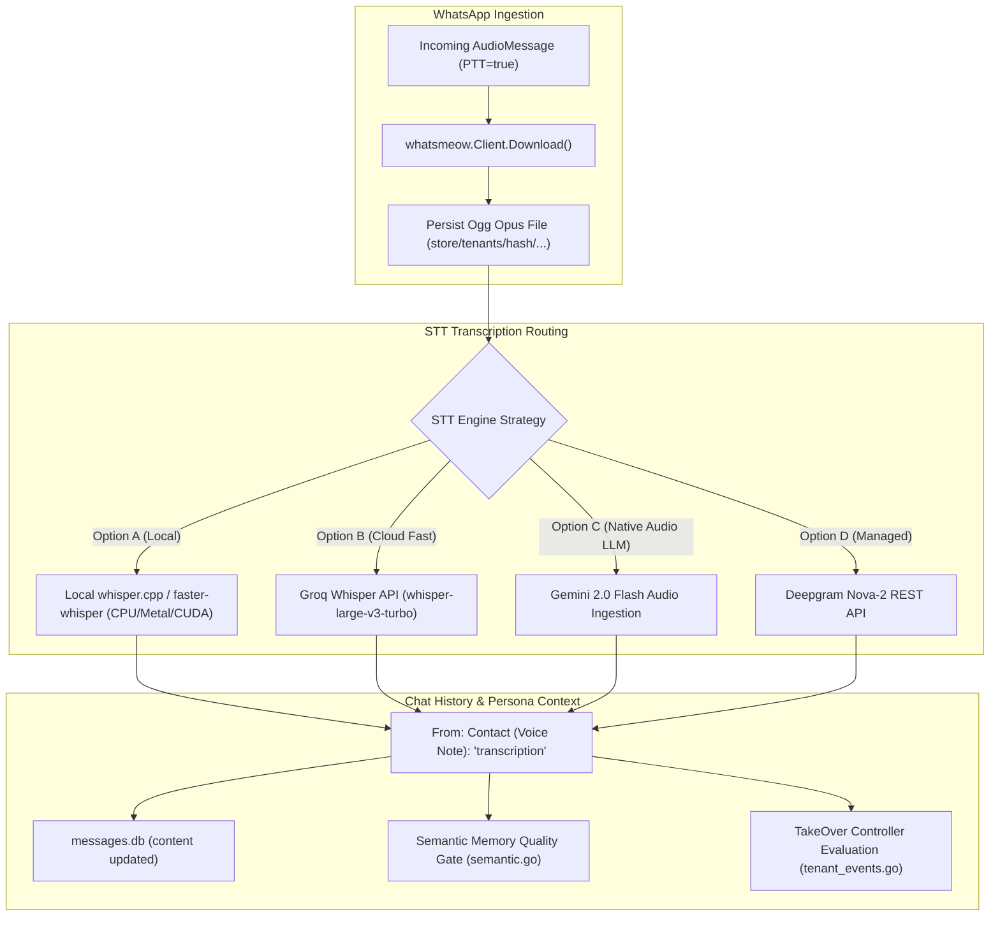
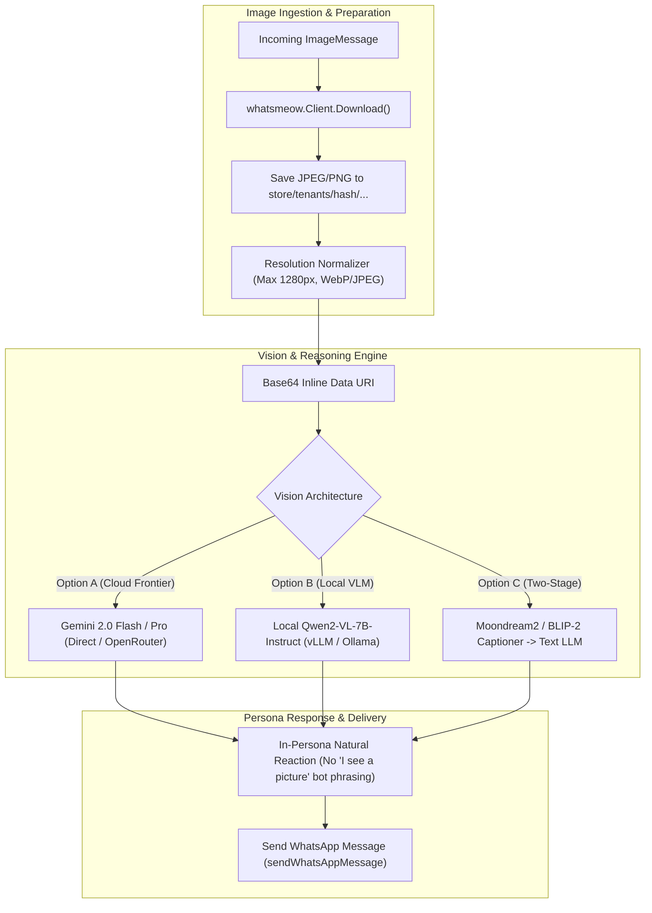
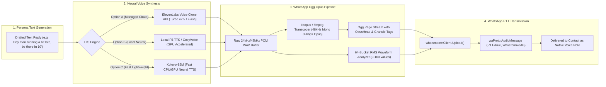
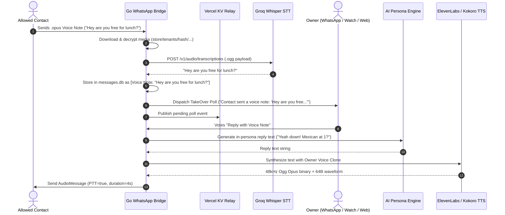
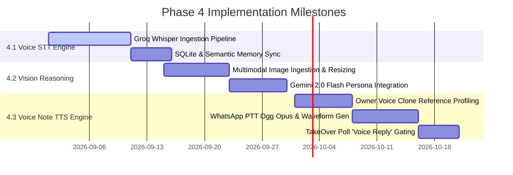

# Architectural Research & Technical Specification: Phase 4 Multimodal Audio, Vision & Voice Engine

---

## Executive Summary

Phase 4 expands the WhatsApp AI & TakeOver system from pure text mirroring to full native multimodal parity with human WhatsApp behavior:
1. **Audio-to-Text (STT)**: Ingesting, decrypting, and transcribing incoming `.opus` voice notes into conversation history and semantic memory.
2. **Multimodal Vision & Image Reasoning**: Ingesting photos, screenshots, memes, and receipts to draft authentic, in-persona reactions without breaking character.
3. **Owner Voice Cloning & Voice Note Generation (TTS)**: Synthesizing WhatsApp-compliant Push-To-Talk (PTT) Ogg Opus voice notes with authentic owner timbre, cadence, and 64-byte waveform visualization.

This document presents a comprehensive evaluation of the architectural trade-offs, compute requirements, container/granule specifications, and concrete integration blueprints across the Go Bridge (`whatsapp-bridge/`), Python Harness (`harness/`), and Next.js Web Control Plane (`web/`).

---

## 1. Subsystem 1: Audio-to-Text (STT) for Incoming WhatsApp Voice Notes

### 1.1 WhatsApp Audio Ingestion Mechanics & Codebase Analysis
* **Protocol & Container**: WhatsApp delivers voice notes as `waProto.AudioMessage` with `mimetype: "audio/ogg; codecs=opus"`, `PTT: true`.
* **Current Codebase State**:
  * `whatsapp-bridge/internal/bridge/media.go`: Downloads and decrypts the encrypted media payload (`.enc`) into local files at `store/<chat_jid>/audio_<timestamp>.ogg`.
  * `whatsapp-bridge/internal/bridge/audio.go`: Parses Ogg container page headers (`OggS`), reads `OpusHead` metadata (sample rate 48,000 Hz, pre-skip), and calculates audio duration via granule positions:
    $$\text{Duration (seconds)} = \left\lceil \frac{\text{lastGranule} - \text{preSkip}}{\text{sampleRate}} \right\rceil$$
  * `whatsapp-bridge/internal/bridge/handlers.go` and `tenant_events.go`: Currently only extract text content from `Conversation` and `ExtendedTextMessage`; incoming voice notes have empty text and do not trigger takeover evaluation.



---

### 1.2 Comparison of STT Architectural Options

| Parameter | Option A: Local Whisper (`whisper.cpp` / `faster-whisper`) | Option B: Cloud Groq Whisper (`whisper-large-v3-turbo`) | Option C: Multimodal Audio LLM (Gemini 2.0 Flash Audio) | Option D: Managed Speech API (Deepgram Nova-2) |
| :--- | :--- | :--- | :--- | :--- |
| **Transcription Latency (10s audio)** | 350ms - 900ms (Metal/CUDA)<br/>1.8s - 3.5s (Host CPU) | **180ms - 320ms** (Total RTT) | 900ms - 1.8s (Joint STT + Reply generation) | 250ms - 450ms |
| **Accuracy on WhatsApp Opus (16-48kHz)** | High with `large-v3`; Medium with `base`/`small` | **Very High** (Full `large-v3` FP16 weights, handles noise/accents) | **Very High** (Understands tone, background ambiance, prosody) | High (Optimized for English; lower for vernacular slang) |
| **Code-Mixed Speech (Hinglish/Tanglish)** | High (`large-v3`); Poor (`small`/`base`) | **Exceptional** (Maintains Latin transliteration) | **Exceptional** (Contextual cultural slang translation) | Moderate (Requires custom vocabulary hints) |
| **Cost per 1,000 Voice Notes (10s each)** | **$0.00** | **$0.00** (Free tier: 7,200s/day)<br/>$0.11 / 1,000 notes thereafter | ~$0.25 (Includes reply generation tokens) | $0.72 ($0.0043/min) |
| **Host Compute Footprint** | 4 - 8 CPU Cores @ 100% or 1.5 - 3 GB VRAM | **0 CPU / 0 GPU** (< 2 MB RAM buffer) | **0 CPU / 0 GPU** | **0 CPU / 0 GPU** |
| **Local Dependencies** | `ffmpeg` / `libopus` / CGo bindings / static C++ library | **Zero** (Accepts native `.ogg` / `.opus` multipart form) | **Zero** (Accepts base64 `.ogg` directly) | Zero (Native Opus ingest) |
| **Integration Complexity** | High (CGo build matrix, Docker toolchains) | **Low** (Single REST call in Go `tenant_events.go`) | **Low** (Direct payload extension in `tenant_ai.go`) | Low (REST API) |

---

### 1.3 Architectural Recommendation for STT
* **Primary (Production Default)**: **Option B (Groq Whisper `whisper-large-v3-turbo`)**.
  * WhatsApp Ogg Opus files are uploaded directly via HTTP multipart POST without needing local transcoding or `ffmpeg` binaries.
  * Turnaround time is sub-300ms, with zero compute load on host servers or local development machines.
  * Superadmin control plane (`web/lib/superadmin.js`) already tracks `groqApiKey` and free-tier daily quotas (7,200s/day).
* **Fallback (Air-Gapped / High-Privacy Local Mode)**: **Option A via `whisper.cpp` standalone CLI/server**.
  * Embedded local daemon listening on `127.0.0.1:8081` running quantized `ggml-large-v3-turbo-q5_0.bin` (550MB RAM, Metal accelerated on macOS).

---

## 2. Subsystem 2: Multimodal Vision & Image Reasoning

### 2.1 WhatsApp Image Ingestion Mechanics & Codebase Analysis
* **Protocol**: WhatsApp images arrive as `waProto.ImageMessage` (JPEG/WebP) and are stored locally via `downloadMedia()` in `whatsapp-bridge/internal/bridge/media.go`.
* **Current Codebase State**:
  * `web/app/components/Chat/MessageBubble.jsx` renders photo cards with the explicit label: `[Not visible to AI]`.
  * `tenant_ai.go` and `harness/send.py` strip media markers (`[image: ...]`), preventing the persona engine from seeing meme contents, screenshots, or receipts.



---

### 2.2 Comparison of Vision Reasoning Architectural Options

| Metric | Option A: Cloud Frontier Vision (Gemini 2.0 Flash / GPT-4o / Claude 3.5 Sonnet) | Option B: Local Vision LLM (Qwen2-VL-7B-Instruct / Pixtral 12B) | Option C: Two-Stage Pipeline (Moondream2 Captioner -> Text LLM) |
| :--- | :--- | :--- | :--- |
| **Reasoning Latency** | **Gemini 2.0 Flash: 650ms - 1.2s**<br/>GPT-4o: 1.4s - 2.2s<br/>Claude 3.5 Sonnet: 1.8s - 3.2s | 1.8s - 3.8s (GPU / Metal)<br/>14s - 40s (Host CPU - Unusable) | 1.8s - 3.0s (400ms caption + 1.5s LLM) |
| **Meme & Cultural Irony Comprehension** | **Exceptional**: Grasps nuanced visual punchlines, sarcasm, subtext | Moderate: Identifies objects and text, but often misses subtle cultural humor | **Poor**: Flattens visual humor into literal descriptive text |
| **Screenshot OCR & UI Spatial Reasoning** | **Exceptional**: Extracts chat transcripts, Instagram UI, receipts with spatial hierarchy | High: Strong multilingual OCR | Moderate: Basic OCR without spatial awareness |
| **Token Cost per Image** | **Gemini 2.0 Flash: ~$0.000025** (258 tokens)<br/>GPT-4o: ~$0.002<br/>Claude 3.5: ~$0.0048 | **$0.00** | $0.00 (Captioner) + standard text LLM token cost |
| **Host Compute / Hardware Footprint** | **0 CPU / 0 GPU** | 6 - 10 GB VRAM (GPU required; fails on low-end servers) | 2.5 GB RAM / VRAM |
| **System Prompting Strategy** | Single-pass joint multimodal prompt containing chat history + image payload | Single-pass multimodal prompt | Two passes: Caption generation -> Text injection into prompt |
| **Privacy & Data Boundary** | Image payload transmitted over TLS to API provider | 100% on-premise / zero egress | 100% on-premise / zero egress |

---

### 2.3 Persona Prompting Specification for Vision
To prevent generic assistant disclosures ("I see a screenshot showing..."), the system prompt must enforce strict in-character human reaction rules:
```
IMAGE UNDERSTANDING RULES:
1. When the other person sends an image (meme, screenshot, photo, receipt, or document), examine it as a human friend would on their phone.
2. React immediately and organically to the visual content (e.g., laugh at the meme, comment on the screenshot drama, react to the bill total).
3. NEVER describe the image literally (do NOT say "In this image, I see...", "This is a photo of...", or "The screenshot displays...").
4. Mirror the owner's typical brevity, sarcasm, and reaction style.
```

---

## 3. Subsystem 3: Owner Voice Cloning & Voice Note Generation (TTS)

### 3.1 WhatsApp Voice Note Format Specification
WhatsApp voice messages have strict encoding and metadata requirements to be recognized as native Push-To-Talk (PTT) voice notes rather than generic audio attachments:

| Parameter | Technical Requirement | Codebase Implementation Reference |
| :--- | :--- | :--- |
| **Container & Codec** | Ogg container wrapping Opus audio stream (`audio/ogg; codecs=opus`) | `whatsmeow.MediaAudio`, `mimetype: "audio/ogg; codecs=opus"` |
| **Channels & Sample Rate** | Mono (1 channel), 48,000 Hz sample rate, 24-32 kbps VBR | Transcoded via `ffmpeg` / `libopus` |
| **Protocol Flag** | `PTT: proto.Bool(true)` | `waProto.AudioMessage.PTT = true` in `whatsapp_api.go:L271` |
| **Granule Calculation** | Accurate end granule position in Ogg stream | `(lastGranule - preSkip) / 48000` in `audio.go:L89` |
| **Waveform Visualization** | **64-byte array** of normalized amplitude values (range: `0` to `100`) | Measured RMS energy envelope across 64 equal time buckets |



---

### 3.2 Comparison of Voice Cloning (TTS) Architectural Options

| Metric | Option A: Managed Cloud Cloning (ElevenLabs / Cartesia Sonic) | Option B: Open-Source Zero-Shot (F5-TTS / CosyVoice / ChatTTS) | Option C: Fast Lightweight Neural (Kokoro-82M / Piper) |
| :--- | :--- | :--- | :--- |
| **Synthesis Latency (10s audio)** | **400ms - 900ms** (TTFB ~150-250ms with streaming) | 1.8s - 4.5s (GPU / Metal)<br/>25s - 60s (CPU - Unusable) | **250ms - 600ms** (Runs sub-second on standard CPU) |
| **Voice Cloning Quality** | **Gold Standard**: Captures micro-inflections, vocal fry, breathing, accents from 1-2 min sample | **Very High**: Excellent similarity with 3-10s clean reference prompt | Moderate: Blends pre-trained style embeddings; lacks fine timbre matching |
| **Conversational Prosody** | High (Authentic pauses, conversational speed modulation) | High (Flow-matching diffusion models capture natural cadence) | Moderate (Clean speech; lacks natural hesitation/colloquial fillers) |
| **Compute Footprint** | **0 CPU / 0 GPU** | 4 - 8 GB VRAM (Requires dedicated GPU instance) | **~200 MB RAM**, < 20% CPU on single core |
| **Cost** | ~$0.015 - $0.03 per 10s voice note | **$0.00** (Excluding GPU infrastructure cost) | **$0.00** |
| **Pipeline Dependencies** | HTTPS REST API + local `ffmpeg` / `opus` encoder | Python PyTorch / Torchaudio / CUDA / MLX daemon | Lightweight Python / ONNX runtime |

---

### 3.3 Accurate 64-Byte WhatsApp Waveform Generation Algorithm
Replacing the placeholder pseudo-random waveform in `whatsapp-bridge/internal/bridge/audio.go:L127` with a true RMS energy extractor:

```go
// GenerateWhatsAppWaveform computes a 64-byte amplitude envelope from 16-bit PCM samples.
func GenerateWhatsAppWaveform(pcmSamples []int16) []byte {
	const waveformLength = 64
	waveform := make([]byte, waveformLength)
	if len(pcmSamples) == 0 {
		return waveform
	}

	samplesPerBucket := len(pcmSamples) / waveformLength
	if samplesPerBucket == 0 {
		samplesPerBucket = 1
	}

	var maxRms float64 = 1.0
	rmsValues := make([]float64, waveformLength)

	// Step 1: Calculate RMS for each of the 64 buckets
	for i := 0; i < waveformLength; i++ {
		start := i * samplesPerBucket
		end := start + samplesPerBucket
		if end > len(pcmSamples) {
			end = len(pcmSamples)
		}
		if start >= end {
			break
		}

		var sum float64
		for _, s := range pcmSamples[start:end] {
			sum += float64(s) * float64(s)
		}
		rms := math.Sqrt(sum / float64(end-start))
		rmsValues[i] = rms
		if rms > maxRms {
			maxRms = rms
		}
	}

	// Step 2: Normalize RMS values to WhatsApp 0-100 range with non-linear scaling
	for i := 0; i < waveformLength; i++ {
		normalized := (rmsValues[i] / maxRms) * 100.0
		// Apply subtle logarithmic compression for realistic voice envelope dynamics
		compressed := math.Pow(normalized/100.0, 0.75) * 100.0
		if compressed < 0 {
			compressed = 0
		} else if compressed > 100 {
			compressed = 100
		}
		waveform[i] = byte(compressed)
	}

	return waveform
}
```

---

## 4. TakeOver Poll UI & Workflow Integration

### 4.1 Enhanced TakeOver Poll Actions (Voice & Media Gating)
The Phase 1-3 TakeOver state machine (`harness/controller.py`, `whatsapp-bridge/internal/bridge/tenant_events.go`, `web/app/components/Chat/TakeOverPollCard.jsx`) supports 4 standard actions: `Send 1 text`, `5 minutes`, `2 hours`, `Deny`.

For Phase 4, the TakeOver approval cards on WhatsApp, Zepp Smartwatch, and the Web Dashboard will expand to support:
1. **`Send 1 text`**: Standard persona text response.
2. **`Reply with Voice Note`**: Triggers TTS voice synthesis to deliver the reply as an authentic Push-To-Talk voice memo.
3. **`5 min auto-takeover`**: Autonomous texting for 5 minutes.
4. **`Deny`**: Revokes pending request.



---

## 5. Architectural Blueprint & Component Modifications

### 5.1 Modifications by Repository Layer

| File / Component | Architectural Changes Needed for Phase 4 |
| :--- | :--- |
| **`whatsapp-bridge/internal/bridge/tenant_events.go`** | 1. Intercept incoming `AudioMessage` and `ImageMessage` events.<br/>2. Invoke `downloadMedia()` automatically for allowed contacts.<br/>3. Dispatch STT transcription to Groq Whisper before evaluating TakeOver trigger.<br/>4. Populate poll question with voice transcript or image context snippet. |
| **`whatsapp-bridge/internal/bridge/tenant_ai.go`** | 1. Extend `callGeminiAPI` and `callOpenAICompatibleAPI` to accept image attachments (base64 inline images).<br/>2. Add `callTTS()` integration (ElevenLabs / Kokoro) when voice note reply is requested.<br/>3. Send outbound `AudioMessage` with generated waveform when voice grant is activated. |
| **`whatsapp-bridge/internal/bridge/audio.go`** | 1. Implement `GenerateWhatsAppWaveform()` using true 64-bucket RMS calculation.<br/>2. Validate Ogg Opus container structures before outbound PTT transmission. |
| **`web/app/components/Chat/MessageBubble.jsx`** | 1. Remove `[Not visible to AI]` visual indicator once vision pipeline is active.<br/>2. Add interactive playable voice note audio bar with dynamic waveform visualizer. |
| **`web/app/components/Chat/TakeOverPollCard.jsx`** | 1. Add `Reply with Voice Note` button variant with microphone SVG icon.<br/>2. Support displaying media thumbnails directly in poll cards. |
| **`web/lib/superadmin.js`** | 1. Support managing `ELEVENLABS_API_KEY`, `CARTESIA_API_KEY`, and voice reference audio uploads per tenant.<br/>2. Telemetry tracking for TTS characters generated and image vision tokens consumed. |

---

## 6. Recommended Phase 4 Phased Rollout Plan



### Recommendation Summary
1. **Voice STT**: Deploy **Groq Whisper `whisper-large-v3-turbo`** directly inside the Go Bridge. It eliminates local dependencies, offers sub-300ms latency, and stays within the free tier (7,200s/day).
2. **Vision Reasoning**: Implement **Gemini 2.0 Flash Multimodal** via direct API or OpenRouter. At $0.000025 per image and ~700ms response time, it provides deep meme, screenshot, and visual context comprehension without local GPU overhead.
3. **Voice TTS**: Deploy **ElevenLabs Turbo v2.5 / Cartesia Sonic** for high-fidelity zero-shot voice cloning, paired with Go-based 64-bucket RMS waveform calculation and native Ogg Opus packaging.
