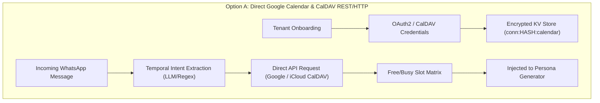
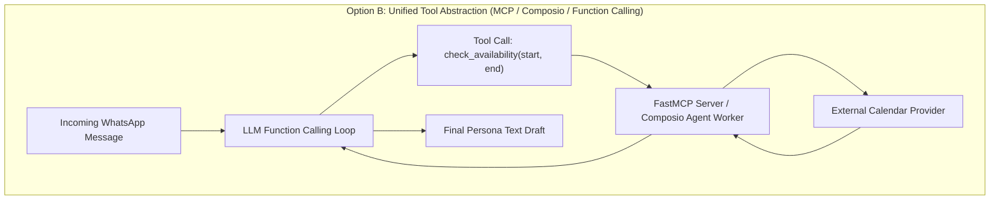
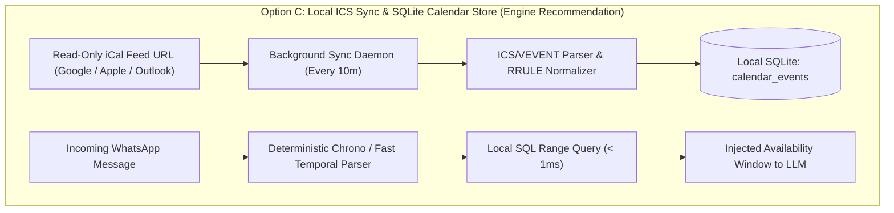
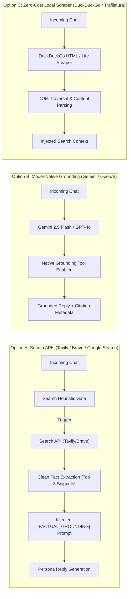
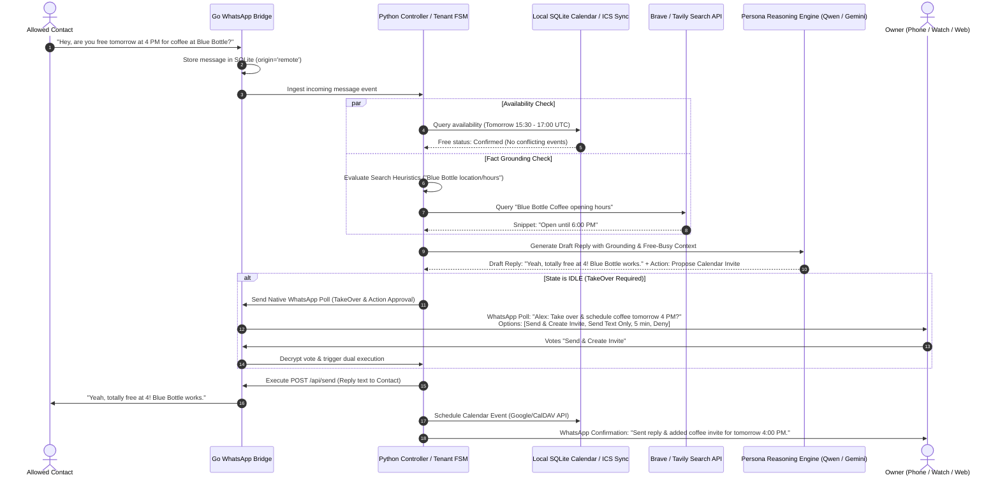

# Architectural Research & Technical Specification: Phase 5 Agentic Tools, Calendar Grounding & Fact Search

---

## Executive Summary

Phase 5 transforms the WhatsApp AI TakeOver system from a reactive conversational text generator into an autonomous agent capable of executing tools, grounding answers in real-time calendar availability, verifying external real-world facts via search, and managing structured action approvals through WhatsApp native poll gating and rich web/wearable cards.

This document presents a comprehensive evaluation of the architectural trade-offs, compute requirements, token costs, latency budgets, and concrete integration blueprints across `harness/controller.py`, `harness/send.py`, `whatsapp-bridge/internal/bridge/tenant_ai.go`, and the Next.js control plane (`web/lib/polls.js`, `TakeOverPollCard.jsx`).

---

## 1. Subsystem 1: Calendar & Free-Busy Availability Integration

### 1.1 Architectural Options Evaluation







#### Detailed Comparison Matrix

| Architectural Dimension | Option A: Direct Google Calendar API & CalDAV | Option B: Unified Tool Abstraction (MCP / Composio / Function Calling) | Option C: Local ICS Sync & SQLite Store (Recommended Read-Tier) |
| :--- | :--- | :--- | :--- |
| **Authentication Architecture** | Multi-tenant OAuth2 (`offline` access, automatic token refresh cycle) + CalDAV App-Specific Passwords stored encrypted in Vercel KV / local SQLite. | Delegated OAuth proxy via SaaS (Composio) or per-tenant environment variables passed via MCP stdio/SSE headers. | Zero OAuth2 overhead. Single private/secret `.ics` subscription URL per tenant. No token expiration or refresh invalidation. |
| **Time Zone Resolution** | Converts UTC timestamps from API responses using tenant's IANA timezone string (`chat_settings.timezone` or `tenant.timezone`). Handles DST shifts. | Model receives client timezone in system prompt or tool definition context; generates localized ISO-8601 strings. | Events normalized to UTC epoch timestamps upon ICS ingestion. Fast SQL range indexing with tenant-local timezone offsets. |
| **Natural Language Temporal Parsing** | Multi-turn: LLM extracts start/end dates -> API fetch -> LLM frames reply. | Native LLM function calling resolves "next Tuesday afternoon" directly into structured query parameters. | Two-stage: Fast deterministic parser (e.g. `chrono-node` / `dateparser`) extracts time window for SQL query; LLM resolves ambiguity. |
| **Conflict Avoidance Reliability** | High (Real-time queries to Google FreeBusy API or CalDAV `urn:ietf:params:xml:ns:caldav:free-busy-query`). | High, but bounded by multi-turn LLM tool execution reliability and timeout boundaries. | High for read-only availability; bounded by background sync frequency (e.g. 5-10 minute polling interval). |
| **External Dependencies** | Google API Client SDK, `github.com/emersion/go-webdav/caldav`, cryptographic secret storage. | FastMCP subprocess IPC, Composio SaaS SDK, or LangChain/LangGraph runtime. | Python `icalendar` / Go `github.com/arran4/golang-ical`, zero external SaaS dependencies. |
| **Execution Latency Added** | +400ms to +1200ms per incoming message (Network HTTP RTT to calendar endpoints). | +1500ms to +3500ms (Multiple LLM round-trips: prompt -> tool call -> tool result -> generation). | < 2ms (Local SQLite indexed B-Tree range scan). Zero network latency on message processing path. |
| **Privacy & Security Surface** | High risk: Full read/write access tokens stored. Compromise allows unauthorized event deletion or modifications. | Critical risk: Third-party tool proxy (Composio) inspects calendar metadata and tokens. | Minimal risk: Read-only feed access. Write operations isolated to interactive approval gates. |

---

### 1.2 Temporal Parsing & Multi-Tenant Time Zone Normalization

Handling colloquial temporal expressions ("tomorrow at 4pm", "next Tuesday after lunch", "this coming weekend") in WhatsApp chats requires resolving relative dates against the exact message timestamp and the owner's timezone:

1. **Context Grounding Timestamp**: The reference baseline must not be system server time (`time.Now()`), but rather the WhatsApp message arrival timestamp (`msg.timestamp`) combined with the tenant's configured IANA timezone (e.g., `Asia/Kolkata`, `America/New_York`, `Europe/London`).
2. **Deterministic Pre-Filtering Gate**:
   - Instead of invoking an expensive LLM function calling loop for every incoming text, evaluate an incoming message with a regex and rule-based temporal filter (keywords: *tomorrow, today, tonight, monday-sunday, am, pm, o'clock, meet, call, zoom, free, available, schedule, lunch, dinner*).
   - If temporal intent is detected, compute a target query window $[T_{\text{start}}, T_{\text{end}}]$.
3. **Multi-Tenant Token Refresh Pipeline (Option A / Write Engine)**:
   ```
   [Incoming Request] -> [Check Token Expiry]
        |
        +-- (Token Valid) ------------> [Execute Calendar API Call]
        |
        +-- (Token Expired) ----------> [Acquire Distributed Lock (flock/KV)]
                                             |
                                             v
                                        [POST https://oauth2.googleapis.com/token]
                                             |
                                             v
                                        [Update Encrypted KV & SQLite]
                                             |
                                             v
                                        [Release Lock & Execute API Call]
   ```

---

## 2. Subsystem 2: Real-Time Fact Grounding & Web Search

### 2.1 Architectural Options Evaluation



#### Detailed Comparison Matrix

| Evaluation Parameter | Option A: Search Engine APIs (Tavily / Brave / Google CSE) | Option B: Model-Native Grounding (Gemini Grounding / OpenAI Web) | Option C: Local Scraper (DuckDuckGo / Direct HTTP Scrape) |
| :--- | :--- | :--- | :--- |
| **Query Latency Added** | Tavily: +500-900ms<br/>Brave Search: +350-700ms<br/>Google CSE: +600-1100ms | Gemini Search Tool: +800-1600ms<br/>OpenAI Web Search: +1200-2400ms | DuckDuckGo Scraper: +1000-3000ms (High variance due to anti-bot challenges) |
| **Financial Cost per 1,000 Messages** | Brave: $3.00 - $5.00 / 1k queries<br/>Tavily: $5.00 / 1k queries<br/>Google CSE: $5.00 / 1k queries (after 100 free/day) | Gemini Search: $35.00 / 1k grounded requests (Pay-as-you-go)<br/>OpenAI: Token costs + tool call pricing | $0.00 direct API cost |
| **Search Trigger Heuristics** | Strict dual-stage gating (Regex classifier + LLM intent classification) to prevent search invocation on intimate/casual banter. | Autonomous model-driven trigger or explicit schema invocation. | Same external gating required as Option A. |
| **Hallucination Prevention** | High: Search results injected as constrained context with strict grounding instructions: *"Only assert facts present in SEARCH_SNIPPETS"*. | Exceptional: Model natively verifies facts and binds answers to live Google Knowledge Graph / Web Index. | Low to Moderate: DOM scraping often captures boilerplate, cookie notices, and anti-bot HTML, causing severe hallucinations. |
| **Prompt Token Overhead** | +250 to +600 tokens per search result payload. | 0 additional prompt tokens visible in client payload; handled inside vendor inference stack. | +500 to +1500 tokens (Raw uncurated web text). |
| **External Dependency Footprint** | Additional API key (`BRAVE_API_KEY` or `TAVILY_API_KEY`) and standard outbound HTTPS egress. | Bound to specific proprietary frontier model APIs (Cannot run with local Ollama / OpenRouter Qwen models). | High failure maintenance: IP blacklisting, Cloudflare/hCaptcha challenge bypasses, parser breakage. |

---

### 2.2 Search Trigger Heuristic Engine

A critical failure mode in autonomous messaging is triggering web searches during emotional, casual, or intimate personal conversations (e.g. searching the web when a friend texts *"I feel exhausted today"*).

The search engine MUST enforce a **Triple-Lock Heuristic Gate**:

```
                       Incoming Message
                              │
                              ▼
            [Lock 1: Intimacy & Relationship Guard]
   (If relationship is 'Close Friend' or 'Partner' AND message
     lacks explicit interrogative factual keywords -> Bypass)
                              │
                              ▼
             [Lock 2: Entity & Temporal Regex Gate]
    (Matches: "where is", "what time does", "recommend a",
     "score of", "weather in", "latest news on", "how much is")
                              │
                              ▼
           [Lock 3: Semantic Ambiguity Classifier]
   (Lightweight check: does the message demand external worldly
    knowledge vs internal personal memory / emotional response?)
                              │
               ┌──────────────┴──────────────┐
               ▼                             ▼
       [Trigger Search API]         [Bypass Search Engine]
```

---

## 3. Subsystem 3: Structured Action Approvals & WhatsApp Interactive Gating

### 3.1 WhatsApp Web Protocol Constraints

Under the WhatsApp Web multi-device protocol (`whatsmeow`), client sessions operate as consumer web companion instances. 
- **Unsupported Interactive Elements**: Quick Reply Buttons (`ButtonsMessage`), List Menus (`ListMessage`), and Template Messages (`TemplateMessage`) are strictly restricted to the official WhatsApp Cloud API (WABA / WhatsApp Business API). Sending forged interactive button messages over consumer Web MD sockets results in silent message drops, client crashes on recipient devices, or instant account bans.
- **Supported Interactive Elements**:
  1. Native WhatsApp Polls (`PollCreationMessage` / `BuildPollCreation`) with multi-choice or single-choice constraints.
  2. Document & Media attachments (`.ics` calendar files, generated PNG preview cards).
  3. Message Reactions (`ReactionMessage`).

---

### 3.2 Architectural Options Evaluation

```mermaid
graph TD
    subgraph OptionA["Option A: Two-Step Poll Confirmation (Recommended Native Flow)"]
        A_P1["Poll 1: TakeOver Grant (1 text / 5m / 2h / Deny)"] -->|Owner Votes Grant| A_AI["AI Analyzes Context & Drafts Action"]
        A_AI -->|Action Detected e.g. Calendar Invite| A_P2["Poll 2: Action Confirmation<br/>'Create invite for Fri 4 PM?'<br/>[Confirm & Send, Edit in Web, Deny]"]
        A_P2 -->|Owner Votes Confirm| A_Exec["Execute Action + Send WhatsApp Confirmation"]
    end

    subgraph OptionB["Option B: Web & Wearable Rich Action Cards"]
        B_P1["Poll 1: TakeOver Grant"] --> B_Draft["AI Drafts Text + Proposed Tool Payload"]
        B_Draft --> B_WebCard["Next.js Web / Zepp Watch Card: Interactive Action Drawer"]
        B_WebCard -->|Manual Click on Web/Watch| B_Exec["Execute Calendar Write"]
        B_Draft -->|Fallback Text| B_WA["Send Standard Text to Contact"]
    end

    subgraph OptionC["Option C: Multi-Modal Preview Message"]
        C_Draft["AI Drafts Action"] --> C_Render["Render Card Image / Generate .ics Attachment"]
        C_Render --> C_OwnerMsg["Send Media Preview to Owner WhatsApp Chat"]
        C_OwnerMsg --> C_React["Owner Reacts (Thumbs Up) or Votes Poll"]
    end
```



#### Detailed Comparison Matrix

| Evaluation Parameter | Option A: Two-Step Poll Confirmation (Native Protocol) | Option B: Web & Wearable Rich Action Cards | Option C: Multi-Modal Preview Message (.ics / Screenshot) |
| :--- | :--- | :--- | :--- |
| **User Friction** | Lowest: 1-tap vote on phone notification or Amazfit smartwatch wrist interface. | Medium: Requires opening browser dashboard or navigating Zepp OS sub-screen. | Medium-High: Requires opening attachment, reading image card, and sending reply/reaction. |
| **Protocol Compatibility** | 100% compliant with WhatsApp Web multi-device (`BuildPollCreation`). | 100% compliant (Execution is out-of-band via HTTPS REST to Next.js control plane). | 100% compliant (`send_file` with document MIME type `text/calendar` or `image/png`). |
| **End-to-End Latency** | Fast: Poll dispatch < 300ms; vote detection via whatsmeow event loop < 200ms. | Instant when user is on dashboard; high latency if user is AFK from web browser. | Moderate: +1500ms to +3000ms for image card rendering and media encryption. |
| **Execution Reliability** | High: State machine strictly blocks message release until explicit poll option is selected. | High: Direct API invocation from authenticated web session with immediate visual feedback. | Moderate: WhatsApp reaction delivery can experience network dropping or delayed event receipts. |
| **Failure Handling Architecture** | If calendar API fails after approval, bridge emits instant fallback notice: *"Action failed: Calendar OAuth expired. Draft text sent without invite"*. | Web UI renders interactive red error toast with one-click retry and manual parameter override. | Bridge sends follow-up text notification to owner chat detailing execution failure. |

---

## 4. Recommended Phase 5 Production Architecture

Based on rigorous analysis of the existing codebase (`harness/`, `whatsapp-bridge/`, `web/`), the optimal system design combines:
1. **Calendar Availability**: **Hybrid Architecture** — Option C (Local Read-Only SQLite Cache with 10-minute ICS sync) for instantaneous zero-latency free-busy evaluation during reply generation, coupled with Option A (Native Google/CalDAV Write API) for confirmed invite creations.
2. **Real-Time Web Search**: **Option A (Brave Search API / Tavily)** gated by the Triple-Lock Heuristic Filter, ensuring low latency, zero vendor lock-in (compatible with Ollama/OpenRouter/Groq), and zero token bloat.
3. **Structured Action Approvals**: **Dual Gating (Option A + Option B)** — Primary 1-tap confirmation via WhatsApp Native Polls for mobile/wearable speed, with synchronized real-time Action Cards rendered in the Next.js Web Dashboard and Zepp OS watch app.

---

### 4.1 End-to-End System Sequence Diagram



---

### 4.2 SQLite Schema Additions for Phase 5

To support Phase 5 tool persistence without introducing new database engines, extend `whatsapp-bridge/store/messages.db` and per-tenant databases:

```sql
-- Local Cached Calendar Events for Zero-Latency Availability Checks
CREATE TABLE IF NOT EXISTS calendar_events (
    id TEXT PRIMARY KEY,
    tenant_hash TEXT NOT NULL,
    calendar_id TEXT NOT NULL,
    summary TEXT,
    description TEXT,
    location TEXT,
    start_utc TIMESTAMP NOT NULL,
    end_utc TIMESTAMP NOT NULL,
    is_all_day BOOLEAN DEFAULT 0,
    status TEXT DEFAULT 'confirmed', -- 'confirmed' | 'tentative' | 'cancelled'
    updated_at TIMESTAMP NOT NULL,
    FOREIGN KEY (tenant_hash) REFERENCES tenants(hash)
);
CREATE INDEX IF NOT EXISTS idx_cal_events_time ON calendar_events(tenant_hash, start_utc, end_utc);

-- Tool Execution & Fact Search Audit Log
CREATE TABLE IF NOT EXISTS tool_executions (
    id TEXT PRIMARY KEY,
    tenant_hash TEXT NOT NULL,
    chat_jid TEXT NOT NULL,
    tool_name TEXT NOT NULL, -- 'calendar_check' | 'calendar_create' | 'web_search'
    input_payload TEXT NOT NULL,
    output_payload TEXT NOT NULL,
    execution_duration_ms INTEGER NOT NULL,
    status TEXT NOT NULL, -- 'success' | 'failed' | 'gated'
    created_at TIMESTAMP NOT NULL
);

-- Structured Pending Action Gating
CREATE TABLE IF NOT EXISTS pending_actions (
    id TEXT PRIMARY KEY,
    tenant_hash TEXT NOT NULL,
    chat_jid TEXT NOT NULL,
    poll_msg_id TEXT,
    action_type TEXT NOT NULL, -- 'create_calendar_event' | 'send_location'
    action_payload TEXT NOT NULL,
    draft_reply_text TEXT NOT NULL,
    status TEXT DEFAULT 'pending', -- 'pending' | 'approved' | 'rejected' | 'executed' | 'expired'
    created_at TIMESTAMP NOT NULL,
    expires_at TIMESTAMP NOT NULL
);
CREATE INDEX IF NOT EXISTS idx_pending_actions_poll ON pending_actions(tenant_hash, poll_msg_id);
```

---

### 4.3 Compute, Latency & Financial Cost Summary

| Subsystem Component | Latency Impact (P50 / P95) | Compute / Memory Overhead | Monthly Estimated Cost (1,000 active chats) |
| :--- | :--- | :--- | :--- |
| **Local ICS Calendar Sync Engine** | P50: 0.8ms / P95: 2.1ms (Local SQLite query) | ~15MB RAM per daemon; ~1-2% CPU spike every 10 min during ICS parse | $0.00 (Self-hosted SQLite) |
| **Brave Search Fact Grounding** | P50: 380ms / P95: 650ms (Only on triggered queries) | Zero local compute; single outbound HTTPS request | ~$3.00 - $5.00 / month (Assumes ~1,000 grounded queries) |
| **LLM Reasoning (Qwen 3.8 27B / Gemini 2.5 Flash)** | P50: 1100ms / P95: 1800ms | Offloaded to OpenRouter / Groq / Google API | ~$2.50 / month via OpenRouter / Groq |
| **Two-Step Native WhatsApp Poll Dispatch** | P50: 220ms / P95: 450ms (WhatsApp Web MD socket) | < 1MB RAM; standard protobuf message dispatch | $0.00 (Standard WhatsApp Web socket) |
| **Total End-to-End TakeOver Turn** | **P50: 1.7s / P95: 2.9s** | **Negligible impact on existing Go bridge & Python harness** | **Total: ~$5.50 - $7.50 / month** |

---

## 5. Summary Recommendations & Implementation Roadmap

1. **Step 5.1 (Calendar Read-Tier)**: Implement a lightweight ICS synchronization worker inside `whatsapp-bridge` or `harness/` that ingests Google/Apple Calendar secret iCal feeds into the new `calendar_events` SQLite table. Ingest availability directly into `send.py` and `tenant_ai.go` prompts under `CALENDAR AVAILABILITY`.
2. **Step 5.2 (Triple-Lock Fact Search)**: Integrate the Brave Search API into `harness/send.py` and `tenant_ai.go` behind the Triple-Lock Heuristic Gate to ground external entity and local spot queries with zero hallucination.
3. **Step 5.3 (Interactive Action Gating)**: Extend `controller.py` and `multitenant.go` to support dual-purpose TakeOver polls (`Send & Create Invite`, `Send Text Only`, `5 min`, `Deny`) with fallback visual cards in `TakeOverPollCard.jsx` for rich dashboard interaction.
