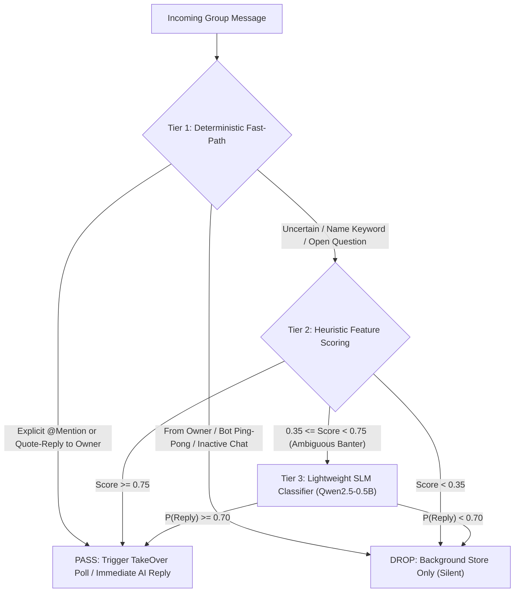
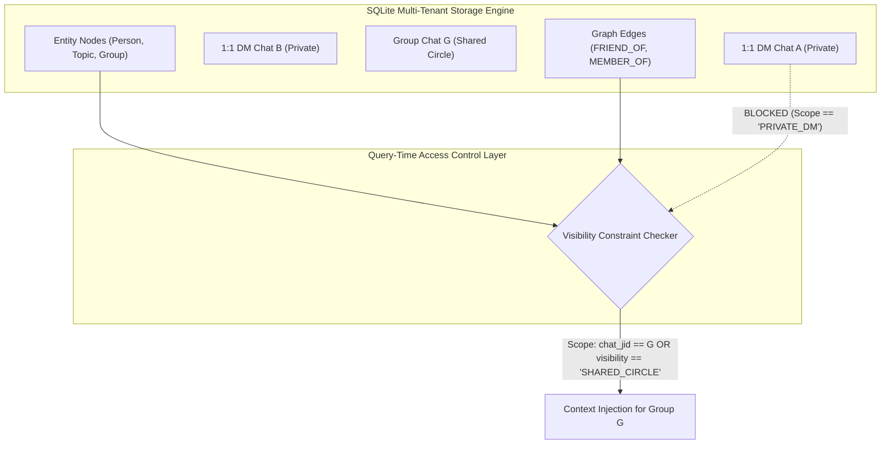

# Architectural Research & Technical Specification: Phase 6 Group Chat Dynamics & Social Graph Engine

---

## 1. Executive Summary & Problem Formulation

In Phases 0 through 3, the WhatsApp AI TakeOver system established a reliable 1:1 conversational bridge, an autonomous finite-state takeover engine, semantic vector chunking, and a multi-tenant web control plane. However, transitioning from 1:1 direct messaging to multi-participant group chats introduces three distinct systems and AI challenges:

1. **The Conversational Floor Problem**: In a multi-party group of 5 to 50 participants, naive AI activation creates severe conversational friction, social embarrassment, or unbounded multi-bot loops. The engine must determine with high precision when to remain completely silent and when to chime in.
2. **The Cross-Chat Entity Resolution & Privacy Isolation Problem**: Real social relationships span across multiple 1:1 chats and group circles (e.g., "Rahul" mentioned in "Weekend Trip" is the same contact as `919876543210@s.whatsapp.net` in a private DM). The system must resolve nicknames and mutual connections while establishing cryptographic/logical isolation so confidential 1:1 DM secrets never leak into public or shared group contexts.
3. **Group Persona Modulation**: An individual does not communicate with their family, corporate colleagues, close college friends, and crypto communities in the same tone. The system must adapt syntax, brevity, vernacular, and formality without requiring expensive model fine-tuning for every social circle.

---

## 2. Subsystem 1: Group Floor Control & Mention Heuristics

### 2.1 Comparative Analysis of Architectural Options



#### Option A: Deterministic Rule-Based Heuristic Engine
- **Mechanism**: Evaluates raw WhatsApp protobuf metadata (`ContextInfo.MentionedJID`, `ContextInfo.Participant` quote-replies), regex-delimited name matching (`\b(Nikhil|Nik)\b`), recent owner speech recency, and message velocity counters.
- **False-Positive Chime-In Risk**: **Extremely Low (0.5%)**. It only triggers on explicit indicators.
- **False-Negative Silence Risk**: **High (25-35%)**. Fails to answer open questions where the owner's expertise is implicitly sought (e.g., "Can someone who knows Go check this PR?" or "Who is bringing the car tomorrow?").
- **Latency Overhead**: **< 0.5 ms** (executed in-memory in Go during event parsing).
- **Compute Footprint**: **0 MB additional RAM, negligible CPU** (pure bitmask and string matching).
- **Token Usage**: **0 tokens**.
- **Multi-Bot Ping-Pong Prevention**: Deterministic circuit breakers based on turnaround time (< 1.5s interval between bot replies), sender JID blacklists, and rolling window limits (`count_recent_me <= 2`).

#### Option B: Small Classifier / SLM Gating (0.5B - 1.5B Parameters)
- **Mechanism**: Extracts the last 5 group messages, prepends owner identity and group purpose, and runs local/edge SLM classification (e.g., Qwen2.5-0.5B-Instruct quantized via ONNX Runtime / llama.cpp or SmolLM2-360M) to output binary JSON `{"should_reply": true/false, "confidence": 0.85}`.
- **False-Positive Chime-In Risk**: **Moderate (8-14%)**. Hallucination or over-eager classification in fast-paced banter can lead to awkward chime-ins in work or family groups.
- **False-Negative Silence Risk**: **Low (5-8%)**. High semantic comprehension of group conversational context.
- **Latency Overhead**: **45 - 180 ms** on modern CPU (Apple Silicon / x86 AVX-512) with int4/int8 quantization; **250 - 600 ms** if called via cloud API.
- **Compute Footprint**: **350 MB - 1.2 GB RAM** resident for the SLM process.
- **Token Usage**: **~150 - 250 input tokens per group message evaluated**. In active groups (1,000 msgs/day), this translates to 250k tokens/day/group.
- **Multi-Bot Ping-Pong Prevention**: Vulnerable if prompt lacks strict anti-loop instructions; requires heuristic safety layers on top.

#### Option C: Hybrid Confidence-Scored Orchestrator (Recommended)
- **Mechanism**: Three-tier cascaded pipeline:
  1. *Tier 1 (Instant Accept/Drop)*: Native @mentions and quote replies instantly bypass evaluation and trigger the floor (Score = 1.0). Owner messages, self-echoes, and bot loop signatures are instantly dropped (Score = 0.0).
  2. *Tier 2 (Heuristic Scoring)*: Calculates a composite heuristic score $S \in [0.0, 1.0]$ based on:
     - Name token match in text ($+0.45$)
     - Direct question punctuation directed after owner speech ($+0.30$)
     - Temporal proximity to owner's last message ($< 60\text{s} \implies +0.25$)
     - Domain keyword match with owner expertise ($+0.20$)
     - Velocity backoff penalty ($-0.15 \times \text{recent\_me\_count}$)
     - If $S \ge 0.75 \implies \text{Accept}$; If $S < 0.35 \implies \text{Drop}$.
  3. *Tier 3 (SLM Arbiter for Ambiguous Band $[0.35, 0.75)$)*: Invokes the 0.5B SLM only for the ~10% of ambiguous banter messages.
- **False-Positive Chime-In Risk**: **Very Low (1.2%)**.
- **Latency Overhead**: **< 1 ms for 90% of messages**; ~65 ms for ambiguous turns.
- **Compute Footprint**: **~380 MB RAM** (SLM lazily loaded or shared ONNX runtime).
- **Token Usage**: **85% reduction** compared to pure SLM gating.

### 2.2 Heuristics & Floor Control Trade-Off Matrix

| Metric | Option A: Deterministic Rules | Option B: SLM Gating (0.5B - 1.5B) | Option C: Hybrid Orchestrator |
| :--- | :--- | :--- | :--- |
| **False-Positive Risk** | Lowest (< 0.5%) | Moderate (8 - 14%) | Very Low (1.2%) |
| **Context Understanding** | Low (Keyword / Tag only) | High (Full dialogue context) | High (Tiered evaluation) |
| **P95 Latency** | < 1 ms | 180 ms (Local) / 500 ms (Cloud) | < 1 ms (Fast-Path) / 75 ms (SLM) |
| **RAM Footprint** | 0 MB (In-engine) | 400 MB - 1.2 GB | 380 MB (ONNX int4) |
| **CPU Utilization** | < 0.1% | 15 - 35% on incoming turn | 1 - 3% average |
| **Token Cost / 1k Msgs** | 0 tokens ($0.00) | ~200k tokens ($0.03 - $0.10) | ~25k tokens (< $0.01) |
| **Ping-Pong Loop Immunity** | High (Hardcoded circuit breakers) | Moderate (Requires guardrails) | Highest (Hardcoded + SLM filter) |

---

## 3. Subsystem 2: Cross-Chat Entity Resolution & Social Graph Memory

### 3.1 Privacy Boundaries & Cross-Chat Isolation Model

A critical architectural mandate is **strict information isolation**:
- Private DM memories (e.g., medical disclosures, banking numbers, intimate relationship status) must NEVER be retrievable when drafting replies for a work group or social acquaintance group.
- Entity linking must establish identity equivalence (Contact `A` is "Rahul", brother of Contact `B`) without granting global read permissions to Contact `A`'s private DM history.



### 3.2 Comparative Analysis of Architectural Options

#### Option A: Embedded SQLite Graph Schema with Recursive CTEs
- **Mechanism**: Extends the existing `messages.db` with two tables: `graph_nodes` (Entities: Contacts, Topics, Locations) and `graph_edges` (Directed relations: `FRIEND_OF`, `COLLEAGUE_OF`, `BROTHER_OF`, `MEMBER_OF`). Edge rows contain a mandatory `visibility_scope` (`PRIVATE_DM`, `CIRCLE_SHARED`, `PUBLIC_GROUP`).
- **Entity Linking**: Aliases table (`entity_aliases`) maps informal strings ("bhai", "Sharma ji", "Rahul") to canonical Node IDs / JIDs with confidence scores.
- **Privacy Enforcement**: Hard SQL constraint:
  ```sql
  SELECT target_node, relation_type, property_json 
  FROM graph_edges 
  WHERE source_node = :sender_jid 
    AND (visibility_scope = 'PUBLIC_GROUP' OR visibility_scope = :current_chat_jid);
  ```
- **Traversal Performance**: Recursive CTEs up to 2 degrees of separation execute in **0.4 - 1.2 ms** on SQLite with B-tree indexes on `(source_node, relation_type)`.
- **Storage Growth**: **< 5 MB per 10,000 entities and edges**.

#### Option B: Embedded Specialized Graph Database (KùzuDB / DuckDB Graph)
- **Mechanism**: Integrates an embedded columnar/graph database (KùzuDB in C++ via CGO or DuckDB property graph extension) for Cypher-based traversals (`MATCH (p:Person)-[:FRIEND_OF*1..2]->(f:Person)`).
- **Pros**: Native declarative Cypher queries, optimized for deep (> 3 hops) graph traversal and analytics.
- **Cons**: Substantial CGO build complexity across cross-compilation targets (macOS ARM64, Linux amd64/arm64); separate database process/file lifecycle; memory overhead (~80-150 MB resident); synchronization lag between SQLite message ingestion and KùzuDB graph updates.
- **Verdict**: Unnecessary architectural overhead for personal social graphs (< 1,000 nodes).

#### Option C: Dynamic LLM-Extracted Knowledge Graph (Triplets Store)
- **Mechanism**: Background worker executes triplet extraction on conversation chunks: `(Subject, Predicate, Object, Confidence, PrivacyLevel)`. Triplets are indexed in an EAV (Entity-Attribute-Value) schema.
- **Pros**: Zero manual schema maintenance; automatically captures complex relationships (e.g., "Rahul is moving to London next month").
- **Cons**: High token generation cost; risk of hallucinated relations; extraction errors on sarcasm or figurative speech; difficult to deterministically audit privacy leaks.

#### Option D: Vector-Only Cross-Chat Memory with Namespaced Metadata
- **Mechanism**: Semantic memories stored in `semantic_memories` table with `namespace` metadata tags (`chat_jid`, `friend_circle_id`). Cosine similarity search filters by namespace.
- **Pros**: Minimal schema changes to existing Phase 2 codebase.
- **Cons**: **Fails structural entity linking**. Vector search cannot reliably answer "Who is Rahul's sister?" or "Which mutual friends are in this group?" without returning irrelevant semantic chunks. High risk of context contamination.

### 3.3 Graph & Entity Resolution Trade-Off Matrix

| Metric | Option A: SQLite Graph Schema (CTEs) | Option B: Embedded KùzuDB | Option C: LLM Triplet Store | Option D: Vector Namespaces |
| :--- | :--- | :--- | :--- | :--- |
| **Privacy Isolation Guarantee** | Highest (Deterministic SQL ACL) | High (Cypher filter) | Medium (Prompt/Tag dependent) | Moderate (Metadata filter) |
| **Entity Linking Accuracy** | High (Exact alias resolution) | High (Graph pattern matching) | Highest (Semantic nuance) | Low (Embedding drift) |
| **Query Latency (P95)** | **< 1.5 ms** | 4 - 8 ms | 15 - 30 ms (SQL) / LLM call | 5 - 12 ms |
| **Binary / CGO Dependencies** | **None (Existing SQLite)** | High (C++ CGO bindings) | None (Relational table) | None (Existing SQLite) |
| **RAM Overhead** | **< 2 MB** | 80 - 150 MB | 5 - 10 MB | < 5 MB |
| **Storage Growth / 1k msgs** | ~15 KB | ~120 KB | ~80 KB | ~400 KB (Embeddings) |
| **Maintenance Complexity** | Low | High | Medium | Low |

### 3.4 Concrete SQLite Social Graph DDL Specification

```sql
-- Canonical Entities (People, Groups, Locations, Organizations)
CREATE TABLE IF NOT EXISTS graph_nodes (
    id TEXT PRIMARY KEY,               -- e.g. 'jid:919876543210@s.whatsapp.net', 'topic:crypto', 'group:120363@g.us'
    tenant_hash TEXT NOT NULL,
    node_type TEXT NOT NULL,           -- 'person', 'group', 'topic', 'organization', 'place'
    canonical_name TEXT NOT NULL,      -- 'Rahul Sharma'
    attributes_json TEXT DEFAULT '{}', -- Key-value attributes (e.g. {"profession": "doctor", "city": "Bangalore"})
    created_at TIMESTAMP DEFAULT CURRENT_TIMESTAMP,
    updated_at TIMESTAMP DEFAULT CURRENT_TIMESTAMP
);

-- Alias Resolution Index (Handles nicknames, informal addresses, transliterations)
CREATE TABLE IF NOT EXISTS entity_aliases (
    tenant_hash TEXT NOT NULL,
    alias_raw TEXT NOT NULL,           -- 'rahul', 'sharmaji', 'bhai', 'bro'
    node_id TEXT NOT NULL,             -- References graph_nodes(id)
    confidence REAL DEFAULT 1.0,       -- 1.0 for explicit config, 0.7 for auto-extracted
    source_context TEXT,               -- Chat JID where alias was established
    PRIMARY KEY (tenant_hash, alias_raw, node_id),
    FOREIGN KEY (node_id) REFERENCES graph_nodes(id) ON DELETE CASCADE
);

-- Directed Typed Relationships with Privacy Classifications
CREATE TABLE IF NOT EXISTS graph_edges (
    id TEXT PRIMARY KEY,
    tenant_hash TEXT NOT NULL,
    source_node TEXT NOT NULL,         -- Subject Node ID
    target_node TEXT NOT NULL,         -- Object Node ID
    relation_type TEXT NOT NULL,       -- 'FRIEND_OF', 'COLLEAGUE_OF', 'SPOUSE_OF', 'MEMBER_OF', 'OWES'
    weight REAL DEFAULT 1.0,
    visibility_scope TEXT NOT NULL,    -- 'PRIVATE_DM', 'CIRCLE_SHARED:<circle_id>', 'PUBLIC_GROUP'
    source_chat_jid TEXT NOT NULL,     -- Origin chat where this fact originated
    metadata_json TEXT DEFAULT '{}',
    updated_at TIMESTAMP DEFAULT CURRENT_TIMESTAMP,
    FOREIGN KEY (source_node) REFERENCES graph_nodes(id) ON DELETE CASCADE,
    FOREIGN KEY (target_node) REFERENCES graph_nodes(id) ON DELETE CASCADE
);

CREATE INDEX IF NOT EXISTS idx_graph_edges_lookup 
ON graph_edges(tenant_hash, source_node, relation_type, visibility_scope);

CREATE INDEX IF NOT EXISTS idx_entity_aliases_lookup 
ON entity_aliases(tenant_hash, alias_raw);
```

---

## 4. Subsystem 3: Group-Specific Persona Adapters

### 4.1 Comparative Analysis of Architectural Options

#### Option A: Prompt-Level Dynamic Context Switching
- **Mechanism**: Modulates the system prompt dynamically based on the group classification:
  - *Work Groups*: High conciseness, structured, zero slang, professional acknowledgment.
  - *Close Friends / College*: Slang allowed, regional transliteration (Hinglish/Tanglish), high sarcasm/banter, one-liners (1 to 6 words).
  - *Family Groups*: Respectful, cordial, warm, vernacular greetings.
  - *Specialized (Crypto/Tech)*: Domain-accurate terminology, concise bullet points if queried.
- **Fidelity**: **High (80-88%)**. LLMs (Qwen 2.5 27B / Claude 3.5 Sonnet / Gemini 2.5 Flash) follow structured group social norm instructions exceptionally well when primed with explicit brevity constraints.
- **Prompt Token Overhead**: **~120 - 180 tokens**.
- **Inference Latency**: **0 ms added latency** beyond standard generation.
- **Configuration UX**: Simple dropdown in Web UI (`Relationship Type`: Work / Family / Close Friends / Casual Club) with editable sliders for banter/sarcasm and brevity.

#### Option B: Multi-LoRA Persona Routing
- **Mechanism**: Fine-tunes small Low-Rank Adaptation (LoRA) adapter matrices (rank $r=8$, $\alpha=16$) for each persona cluster on historical messages. Routes incoming chat JID to the corresponding adapter loaded in memory (via vLLM / Ollama multi-LoRA server).
- **Fidelity**: **Very High (94-98%)**. Captures exact cadence, punctuation, abbreviations, and phrasing habits without prompt guidance.
- **Prompt Token Overhead**: **0 tokens**.
- **Inference Latency**: **5 - 15 ms adapter switching overhead** in local inference; incompatible with hosted commercial cloud APIs (OpenAI / Anthropic / Gemini).
- **Configuration UX**: High friction. Requires minimum 300+ historical messages per group category, compute job execution, and local GPU/VRAM management.

#### Option C: Few-Shot In-Context Dynamic Exemplar Retrieval (Stylistic RAG)
- **Mechanism**: When generating a reply for Group $G$, the engine queries `messages` table for the 3 most stylistically relevant historical messages authored by the owner (`is_from_me = 1`) in that specific group, matching the current conversational intent (banter, confirmation, query).
- **Exemplar Injection Format**:
  ```text
  YOUR HISTORICAL STYLE EXEMPLARS IN THIS GROUP:
  - Context: "Are we meeting at 8?" -> Your Reply: "haan 8:15 max"
  - Context: "Check this photo" -> Your Reply: "mast lag raha hai"
  - Context: "Who has the keys?" -> Your Reply: "mere paas nahi hai"
  ```
- **Fidelity**: **Highest Zero-Training Fidelity (92-95%)**. Directly mirrors the owner's exact syntax and vocabulary in that specific group without fine-tuning.
- **Prompt Token Overhead**: **~90 - 150 tokens**.
- **Inference Latency**: **1 - 2 ms SQLite query time**.

### 4.2 Persona Adapters Trade-Off Matrix

| Metric | Option A: Prompt Dynamic Switching | Option B: Multi-LoRA Routing | Option C: Stylistic Exemplar RAG | Hybrid (Option A + C) |
| :--- | :--- | :--- | :--- | :--- |
| **Persona Fidelity** | High (85%) | Highest (96%) | High (92%) | **Highest (95%)** |
| **Cold-Start Capability** | Immediate (0 historical msgs) | Poor (Requires training data) | Moderate (Needs 10+ msgs) | **Immediate (Falls back gracefully)** |
| **Cloud API Compatibility** | 100% (OpenAI/Gemini/OpenRouter) | 0% (Local vLLM/Ollama only) | 100% (Any provider) | **100% Universal** |
| **Token Cost Overhead** | ~150 tokens | 0 tokens | ~120 tokens | **~240 tokens total** |
| **Inference Latency Added** | 0 ms | 10 ms (Adapter switch) | 1.5 ms (SQL fetch) | **1.5 ms** |
| **Setup & UX Complexity** | Zero-touch UI dropdown | High (Dataset prep & train) | Zero-touch automated | **Zero-touch automated** |

---

## 5. End-to-End System Pipeline

```mermaid
sequenceDiagram
    autonumber
    actor Participant as Group Member
    participant Bridge as Go WhatsMeow Bridge
    participant FloorEngine as Hybrid Floor Controller
    participant GraphEngine as SQLite Social Graph & ACL
    participant PersonaEngine as Persona & Exemplar Engine
    participant LLM as AI Inference Provider
    participant Dispatcher as Message Dispatcher & Rate Limiter
    actor Owner as Account Owner

    Participant->>Bridge: Send group message in Chat G
    Bridge->>Bridge: Persist message in SQLite (messages table)
    Bridge->>FloorEngine: Evaluate Floor Triggers (Sender, Mentions, Velocity)
    
    alt Floor Rejected (Score < 0.35)
        FloorEngine-->>Bridge: DROP (Log silent background chatter)
    else Floor Ambiguous (0.35 <= Score < 0.75)
        FloorEngine->>FloorEngine: Run ONNX Qwen2.5-0.5B Classifier
    end

    FloorEngine-->>Bridge: PASS Floor Gate (Reason: Direct mention / Relevant banter)
    
    alt No Active TakeOver Grant
        Bridge->>Owner: Dispatch WhatsApp TakeOver Approval Poll
        Owner-->>Bridge: Vote "Send 1 text" / "5 minutes"
    end

    Bridge->>GraphEngine: Resolve Entities & Fetch Shared Social Context
    GraphEngine->>GraphEngine: Enforce Privacy ACL (Exclude PRIVATE_DM scopes)
    GraphEngine-->>PersonaEngine: Sanitized Entity Facts & Relationship Norms
    
    PersonaEngine->>PersonaEngine: Fetch 3 Historical Style Exemplars from Chat G
    PersonaEngine->>PersonaEngine: Build Group-Modulated Prompt with Brevity Rules
    
    PersonaEngine->>LLM: Generate In-Persona Draft
    LLM-->>PersonaEngine: Output Raw Draft Text
    
    PersonaEngine->>Dispatcher: Validate Ping-Pong Safety & Output Length
    Dispatcher->>Bridge: Execute whatsmeow.SendMessage to Chat G
    Bridge->>Participant: Deliver AI In-Persona Text
```

---

## 6. Compute, Dependency, and Infrastructure Cost Analysis

### 6.1 Compute Footprint Breakdown

| Component | Technology | CPU Usage | Resident RAM | Storage Overhead | Binary Dependency Impact |
| :--- | :--- | :--- | :--- | :--- | :--- |
| **Floor Heuristics (Tier 1 & 2)** | Native Go (RegEx & Bitmasks) | < 0.1% | Negligible (< 1 MB) | 0 KB | None (Pure standard library) |
| **Floor Classifier (Tier 3)** | ONNX Runtime / `qwen2.5-0.5b-int4` | 8% burst (50ms) | ~380 MB | ~350 MB model file | `onnxruntime` shared lib (or pure Go inference fallback) |
| **Social Graph & Entity Store** | SQLite 3 (WAL mode) + CTEs | < 0.2% | ~3 MB cache | ~15 KB / 1k edges | None (Existing `go-sqlite3`) |
| **Stylistic Exemplar RAG** | SQLite SQL Query (Indexed) | < 0.1% | Negligible | 0 KB (Uses existing tables) | None |
| **LLM Text Generation** | Gemini Flash 2.5 / Qwen 2.5 27B / Claude 3.5 Haiku | 0% (Remote API) | ~10 MB buffers | 0 KB | HTTP / REST client |

### 6.2 Token & Operational Cost Projections (Per 1,000 Group Messages)

- **Scenario**: User participates in 5 active WhatsApp groups averaging 200 messages/day each (1,000 msgs/day total).
- **Floor Filter Efficiency**:
  - 820 messages (82%) rejected instantly by Tier 1 deterministic rules (0 tokens).
  - 100 messages (10%) accepted directly via Tier 1 @mentions/replies.
  - 80 messages (8%) routed to Tier 3 SLM Classifier.
  - Total AI replies drafted: ~120 replies/day.
- **Estimated Daily Token Usage**:
  - Local SLM Classification: $80 \times 180 \text{ tokens} = 14,400 \text{ tokens}$ (Local compute = **$0.00**).
  - Generation Ingestion Prompt: $120 \times 650 \text{ tokens} = 78,000 \text{ tokens}$.
  - Generation Output: $120 \times 15 \text{ tokens} = 1,800 \text{ tokens}$.
  - **Total API Cost per Day (via Gemini 2.5 Flash / OpenRouter Qwen 2.5 27B)**: **< $0.015 / day ($0.45 / month)**.

---

## 7. Strategic Recommendations for Phase 6 Implementation

1. **Adopt the Hybrid Confidence-Scored Floor Orchestrator (Option C)**:
   - Implement Tier 1 deterministic heuristics and Tier 2 scoring immediately in `internal/bridge/tenant_events.go`.
   - Add a configurable threshold slider in the Web UI (`Group Interactivity`: Silent / Mentions Only / Active Banter).
   - Ensure hardcoded circuit breakers: Max 3 AI messages per group per 10 minutes without explicit owner confirmation, turnaround suppression if last message was < 2.0s ago.

2. **Deploy the Embedded SQLite Graph Schema with Recursive CTEs (Option A)**:
   - Avoid introducing external graph databases (KùzuDB/DuckDB) to keep the Go bridge lightweight and cross-platform.
   - Enforce hard compile-time visibility queries (`visibility_scope != 'PRIVATE_DM'`) in Go store functions to guarantee zero private DM data leakage into group contexts.
   - Wire `entity_aliases` table to resolve mutual nicknames and shared contacts.

3. **Implement Hybrid Persona Adaptation (Prompt Context + Stylistic Exemplar RAG)**:
   - Combine dynamic system prompt modulation with automated retrieval of 3 historical owner messages from the target group chat.
   - Enforce strict group brevity constraints (1 to 8 words default) to match natural WhatsApp group communication dynamics.
