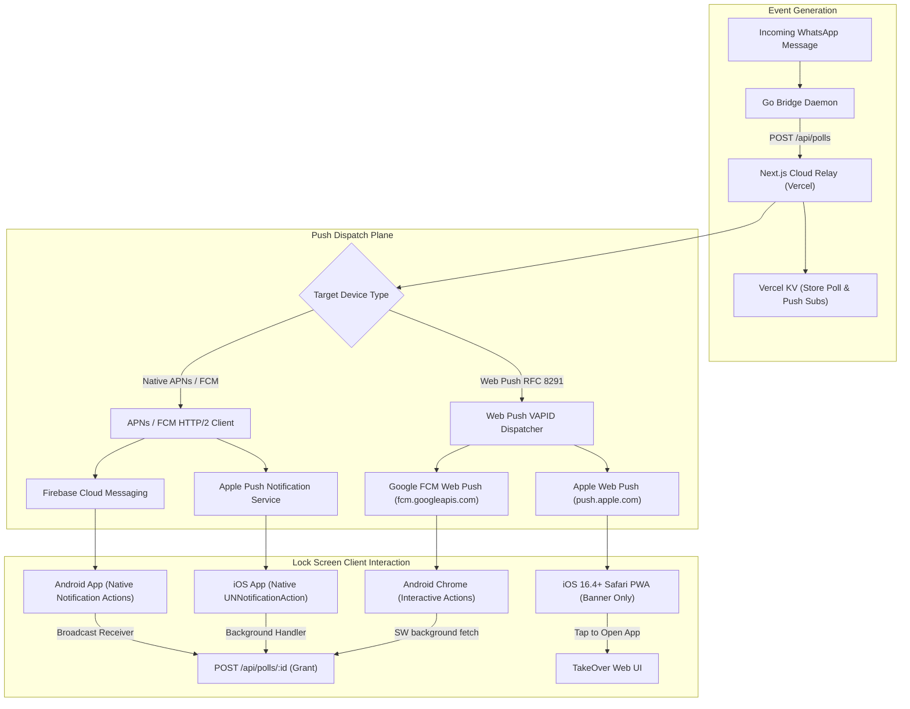
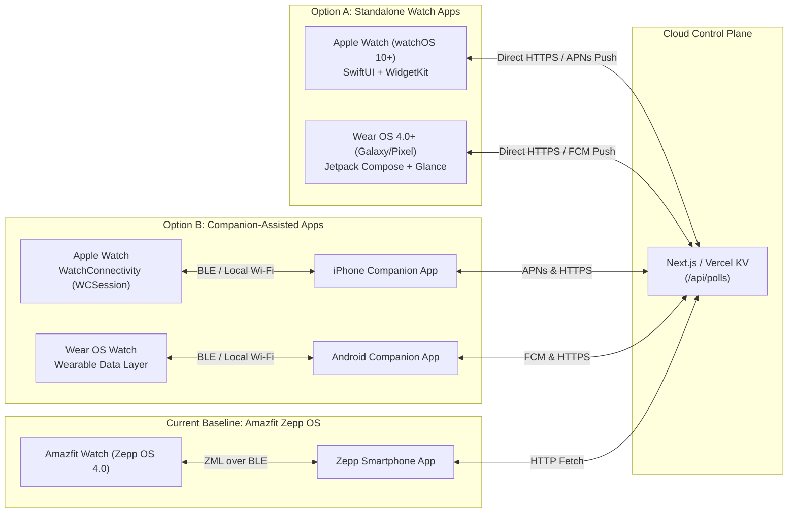
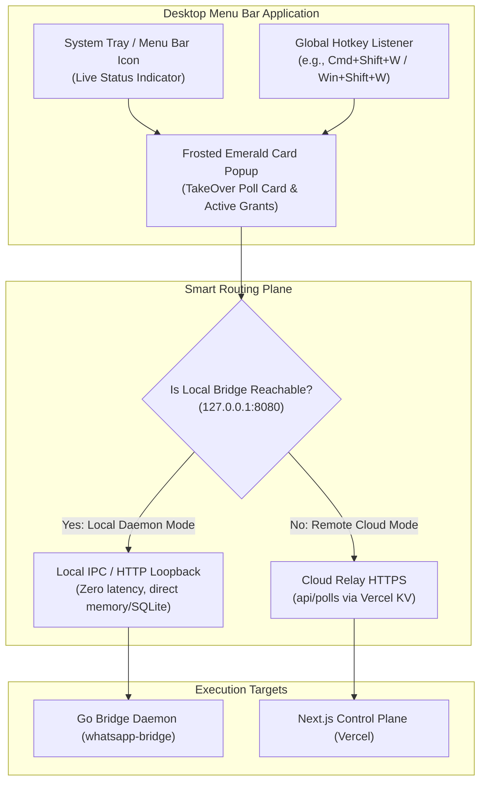

# Architectural Research & Technical Specification: Phase 7 Mobile-First Push & Multi-Device Wearables

---

## Executive Summary & System Baseline

The WhatsApp AI TakeOver system operates on a dual-plane architecture:
1. **Core Execution Plane (Local Daemon)**: Go `whatsmeow` bridge (`whatsapp-bridge/internal/bridge/`) maintaining persistent WhatsApp WebSocket sessions, decrypting incoming messages, managing state machines, executing LLM inference, and enforcing TakeOver grants (`grantKind = "count" | "duration"`).
2. **Cloud Relay & Control Plane (Serverless Web)**: Next.js 14 deployed on Vercel backed by Vercel KV (Upstash Redis) for poll state (`web/lib/polls.js`, `web/app/api/polls/`), passkey authentication (`web/lib/passkeys.js`), and JWT session tokens (`web/lib/jwt.js`).
3. **Current Wearable Baseline (Zepp OS 4.0)**: Amazfit T-Rex 3 application (`zepp/`) utilizing the Zepp Mobile Link (ZML) protocol. The smartwatch runs a lightweight JS UI communicating over Bluetooth Low Energy (BLE) to an app-side companion service on the smartphone, which in turn performs HTTP RPC calls to `/api/polls/pending` and `/api/polls/[id]`.

Phase 7 expands the notification and gating plane across everyday user touchpoints: Web Push (PWA/VAPID), Apple Watch (watchOS) & Wear OS standalone apps, and Desktop Menu Bar companions (macOS & Windows).

---

## 1. Subsystem 1: Web Push Notifications (PWA / VAPID)



### 1.1 Architectural Options Breakdown

#### Option A: Native Web Push API with VAPID Keys + Service Worker
* **Protocol & Standards**: Implements Web Push Protocol (RFC 8030), Message Encryption (RFC 8291 `aes128gcm`), and Voluntary Application Server Identification (RFC 8292 VAPID).
* **iOS Safari (16.4+) Constraints**:
  * PWA Installation Mandatory: Web Push is strictly disabled in standard Safari tabs. The user must manually tap "Share -> Add to Home Screen" (`display: standalone` in `manifest.json`).
  * Permission Prompt Requirement: `Notification.requestPermission()` must be invoked from an explicit user gesture (button tap inside standalone PWA).
  * Lock Screen Action Button Limitation: WebKit on iOS does **NOT** support the `actions` field within `NotificationOptions`. Lock screen banners show title, body, and app icon, but interactive buttons ("1 text", "5 min", "Deny") are stripped by iOS. Tapping the banner launches the standalone PWA window.
* **Android Chrome Capabilities**:
  * Full support for up to 3 interactive actions: `actions: [{ action: 'grant_1', title: '1 text' }, { action: 'grant_5m', title: '5 min' }, { action: 'deny', title: 'Deny' }]`.
  * The Service Worker handles `notificationclick` in the background, executes `fetch('/api/polls/' + pollId, { method: 'POST', body: JSON.stringify({ option, source: 'webpush_action' }) })`, and closes the notification without ever bringing the browser to the foreground.
* **Payload Encryption & Serverless Delivery**:
  * Push subscriptions (`endpoint`, `keys.p256dh`, `keys.auth`) are persisted in Vercel KV under `tenant:HASH:push_subscriptions`.
  * Next.js Edge/Node handlers utilize standard WebCrypto (`crypto.subtle`) or `web-push` to derive ECDH shared secrets and encrypt payloads with AES-128-GCM before dispatching via HTTPS to push service endpoints.
* **Latency Profile**: Bridge HTTP event to Cloud Relay (100-200ms) + Vercel KV lookup & VAPID signing (30-60ms) + Push Server relay to device (150-350ms) = **280ms - 610ms total latency**.

#### Option B: Hybrid Native Wrapper (Capacitor / React Native App)
* **Protocol & Standards**: Direct integration with Apple Push Notification service (APNs HTTP/2) and Firebase Cloud Messaging (FCM HTTP v1).
* **iOS Native Capabilities**:
  * Full Lock-Screen Action Buttons: Registers `UNNotificationCategory` with `UNNotificationAction` identifiers (`GRANT_1_TEXT`, `GRANT_5_MIN`, `DENY`). Actions appear on long-press or direct banner buttons on iOS lock screens.
  * Background Execution: Uses `UNNotificationActionOptionAuthenticationRequired` and background execution contexts to immediately trigger the vote API without opening the app UI.
  * No PWA Installation Gate: Works out of the box upon app installation from App Store or TestFlight.
  * Silent Push Wakeup: Supports `content-available: 1` background pushes to refresh local state.
* **Payload Structure & Security**:
  * Plaintext JSON payload transmitted over TLS directly to APNs / FCM servers authenticated via APNs Auth Key (`.p8` JWT) and Google Service Account OAuth2 token.
  * Eliminates client-side RFC 8291 key negotiation issues.
* **Latency Profile**: Bridge HTTP event to Cloud Relay (100-200ms) + APNs/FCM HTTP/2 post (40-80ms) + Push delivery (100-250ms) = **240ms - 530ms total latency**.

#### Option C: Push Notification Relay Services (OneSignal / Pusher Beams / FCM Web SDK)
* **Protocol & Standards**: Proprietary REST API layer abstracting Web Push, APNs, and FCM behind a unified SaaS endpoint.
* **Trade-offs**:
  * Introduces an extra network hop: Next.js -> OneSignal API -> APNs/FCM -> Device, adding 80-200ms extra latency.
  * Lock-screen action capabilities remain fundamentally constrained by the target OS (iOS Safari Web Push still drops action buttons; iOS Native wrapper supports them).
  * Tenant isolation & privacy risk: WhatsApp contact names and message snippets pass through third-party SaaS servers, violating strict zero-knowledge multi-tenant privacy principles.

---

### 1.2 Push Notification Architecture Comparison Matrix

| Architectural Dimension | Option A: Native Web Push (PWA/VAPID) | Option B: Hybrid Wrapper (Capacitor/RN) | Option C: Push Relay SaaS (OneSignal) |
| :--- | :--- | :--- | :--- |
| **iOS Lock-Screen Action Buttons** | Not Supported (OS drops `actions`) | Fully Supported (`UNNotificationAction`) | Not Supported on Web / Yes on Native |
| **Android Lock-Screen Action Buttons** | Fully Supported (Service Worker) | Fully Supported (BroadcastReceiver) | Fully Supported |
| **iOS Installation Requirement** | Mandatory ("Add to Home Screen" PWA) | Standard App Install (App Store/TestFlight) | PWA install for Web / Store for App |
| **Background Wake / Silent Push** | Unsupported on iOS Safari | Supported (`content-available: 1`) | Supported on Native only |
| **Payload Encryption Overhead** | High (RFC 8291 ECDH + HKDF + AES-GCM) | Low (Handled by APNs/FCM TLS transport) | Medium (SaaS SDK abstraction) |
| **Serverless Compatibility** | High (Native Node/Edge WebCrypto) | High (Direct APNs HTTP/2 via JWT) | High (Simple REST POST) |
| **Tenant Privacy & Compliance** | High (Zero third-party data transit) | High (Direct Apple/Google pipes only) | Low (Third-party ingestion & logs) |
| **Operating Cost (Infrastructure)** | Zero ($0 SaaS cost, utilizes Vercel KV) | Zero ($0 SaaS cost, Apple Dev $99/yr) | Recurring ($99 - $500+/mo at scale) |
| **End-to-End Latency** | 280ms - 610ms | 240ms - 530ms | 380ms - 850ms |

---

## 2. Subsystem 2: Apple Watch (watchOS) & Wear OS Standalone Apps



### 2.1 Architectural Options Breakdown

#### Option A: Native SwiftUI watchOS App + Jetpack Compose Wear OS App (Standalone)
* **Network & Connectivity**:
  * Standalone direct Wi-Fi and Cellular (eSIM) operation. The watch communicates directly with `https://whatsapp-ai-nikhil.vercel.app/api/polls/pending` and `POST /api/polls/:id` via `URLSession` (Swift) and `Ktor` / `OkHttp` (Kotlin).
  * Zero dependency on phone proximity or Bluetooth connectivity.
* **Push Wakeup Architecture**:
  * **watchOS**: Utilizes APNs with `pushType: .alert` for interactive notification banners with dynamic actions ("Send 1 text", "5 min", "Deny"), and `pushType: .complication` to wake the watch app in the background and refresh WidgetKit timelines.
  * **Wear OS**: Utilizes high-priority FCM data messages handled by `FirebaseMessagingService`, invoking `TileService.requestUpdate()` and posting heads-up notification channels with action intents.
* **Complications & Glanceable UI**:
  * **watchOS**: Built with `WidgetKit`. Supports `AccessoryRectangular` (showing pending question and contact name), `AccessoryCircular` (displaying active TakeOver state icon), and `AccessoryInline`. Live countdowns use native text interpolation: `Text(poll.expiresAt, style: .timer)`.
  * **Wear OS**: Built with `Jetpack Glance` and `TileService` / `ComplicationDataSourceService`. Renders interactive quick-glance tiles with direct button clicks to vote.
* **Battery Profile**:
  * Event-driven push execution ensures 0% continuous background battery drain (no active polling loops or open WebSockets). Wakes only on incoming poll events for < 2 seconds.

#### Option B: Companion-Assisted Watch Apps (WatchConnectivity / Wearable Data Layer)
* **Architecture**:
  * Mirrors the current Zepp OS model (`zepp/app-side/index.js`).
  * The iOS / Android phone app handles all network connectivity, push notifications, and Vercel authentication.
  * The watch connects strictly via Bluetooth Low Energy (BLE) or local bridged Wi-Fi using `WatchConnectivity` (`WCSession.default.transferUserInfo` / `sendMessage`) on iOS and Google `Wearable.DataClient` / `MessageClient` on Android.
* **Trade-offs**:
  * Pros: Simpler watch binary; offloads cryptographic operations and network TLS handshakes to phone; minimal watch battery consumption.
  * Cons: Immediate failure when the user is away from their phone (e.g., workouts, running, phone battery dead). `WCSession` message queues can be delayed or throttled by iOS power management when the phone is in deep sleep.

#### Option C: Cross-Platform Wearable Framework (Flutter Wear / React Native Watch)
* **Technical Infeasibility on watchOS**:
  * Apple watchOS strictly forbids custom JavaScript engines (no JIT) and does not support Flutter's C++ rendering engine. React Native watch solutions rely on brittle native bridges embedding a limited JavaScript core, resulting in app sizes > 40MB, sluggish UI response (> 800ms frame drops), and high crash rates.
  * Wear OS technically supports Flutter/React Native, but memory footprint (> 60MB RAM) exceeds practical constraints for low-power smartwatches.

---

### 2.2 Wearable Platform Comparison Matrix

| Architectural Dimension | Option A: Native Standalone (SwiftUI + Jetpack Compose) | Option B: Companion-Assisted (WatchConnectivity / Data Layer) | Option C: Cross-Platform (React Native / Flutter Wear) | Baseline: Amazfit Zepp OS 4.0 (`zepp/`) |
| :--- | :--- | :--- | :--- | :--- |
| **Standalone Cellular / Wi-Fi** | Full Standalone (Direct HTTP/APNs/FCM) | None (Requires Phone BLE connection) | Partial on Wear OS / Broken on watchOS | None (Requires Zepp Phone App) |
| **Watch UI Toolkit** | SwiftUI (watchOS 10+) / Jetpack Compose Wear | SwiftUI / Jetpack Compose Wear | React Native Bridge / Flutter Canvas | Zepp JS UI (`@zos/ui` Canvas) |
| **Lock-Screen / Wrist Push Wake** | Instant APNs / FCM Push Wake (< 300ms) | Dependent on Phone Companion waking watch | Unreliable background wake | BLE notify from Zepp Phone Companion |
| **Complication / Tile Capabilities** | Full WidgetKit Timelines & Glance Tiles | Basic Complications updated via Phone push | Highly restricted / Not supported | None / Basic Watchface shortcuts |
| **Active Grant Countdown Display** | Native `Text(..., style: .timer)` | Static text updated periodically | Static text | Static text on page refresh |
| **RAM Footprint on Device** | 8MB - 14MB | 6MB - 10MB | 55MB - 90MB (Heavy runtime) | < 2MB (QuickJS bytecode) |
| **Battery Drain Profile** | Event-driven (< 1% daily impact) | Minimal (< 0.5% daily impact) | High (Continuous runtime overhead) | Minimal (Optimized RTOS) |
| **Development & Maintenance** | High (2 native codebases: Swift & Kotlin) | High (Watch + Companion bridges) | Extreme (Fighting platform limitations) | Low (Single JS codebase with ZML) |

---

## 3. Subsystem 3: Desktop Menu Bar Companion (macOS & Windows)



### 3.1 Architectural Options Breakdown

#### Option A: Native Swift Menu Bar App (macOS) + Windows C#/WPF Tray App
* **macOS Implementation**:
  * Built using SwiftUI `MenuBarExtra` or AppKit `NSStatusItem` / `NSPopover`.
  * Renders native frosted glass UI matching macOS Sequoia visual hierarchy.
  * RAM consumption: **12MB - 18MB**. Cold startup time: **< 50ms**.
  * Global Hotkey support via Carbon `RegisterEventHotKey` or `CGEvent.tapCreate` allowing instant toggle of the TakeOver approval modal.
* **Windows Implementation**:
  * Built using C# / .NET 8 with WinUI 3 / WPF and `TaskbarIcon`.
  * RAM consumption: **35MB - 50MB**. Cold startup time: **< 150ms**.
* **Auto-Update & Distribution**:
  * macOS: Sparkle 2 framework (`Sparkle.framework`) with EdDSA signed app casts.
  * Windows: Velopack or WinGet packaging pipeline.

#### Option B: Lightweight Rust + Tauri v2 Desktop App
* **Architecture**:
  * Core runtime written in Rust leveraging `tauri::tray::TrayIconBuilder` and `@tauri-apps/plugin-global-shortcut`.
  * UI layer: Reuses existing React / Tailwind components from `web/app/components/Chat/TakeOverPollCard.jsx` rendered inside a lightweight native webview (WKWebView on macOS, WebView2 on Windows).
  * Supports dark/light mode and CSS variable injection (`var(--wa-teal)`, `var(--wa-card-bg)`) matching the Emerald Glass design system with 0 code duplication.
* **Performance Profile**:
  * RAM consumption: **18MB - 28MB** (shares system webview runtime; does not bundle Chromium).
  * Cold startup time: **< 120ms**.
  * Single cross-platform Rust codebase with unified build pipelines for macOS (`.dmg`, `.app`) and Windows (`.msi`, `.exe`).
* **IPC & Local Bridge Direct Communication**:
  * Rust native backend can communicate directly with the local Go Bridge daemon via UNIX Domain Socket (`/tmp/whatsapp-mcp.sock`) or loopback HTTP (`http://127.0.0.1:8080/api/connections/:hash/grant`), achieving sub-millisecond voting latency when running on the same machine.
  * Fallback to Cloud Relay (`https://whatsapp-ai-nikhil.vercel.app/api/polls`) when traveling away from the host server.
* **Auto-Update**:
  * Native Tauri updater (`@tauri-apps/plugin-updater`) with minisign cryptographic signature verification.

#### Option C: Electron / Wails / Go-Fyne Menu Bar App
* **Electron Evaluation**:
  * Bundles complete Chromium engine + Node.js runtime.
  * RAM consumption: **140MB - 280MB** for an idle tray icon.
  * Unacceptable resource footprint for a background menu bar utility.
* **Wails v2 Evaluation**:
  * Go backend with native webview frontend.
  * RAM consumption: **25MB - 45MB**.
  * Downside: Tray support on macOS (`systray`) has known quirks with window positioning and multi-display setups; lacks mature native global shortcut plugins compared to Tauri v2.
* **Fyne Evaluation**:
  * Pure Go GUI toolkit with custom OpenGL/software rendering.
  * Downside: Does not look native; cannot render frosted glass (`backdrop-filter: blur(24px)`); cannot reuse React web components.

---

### 3.2 Desktop Menu Bar Comparison Matrix

| Architectural Dimension | Option A: Native (Swift + WinUI 3) | Option B: Rust / Tauri v2 | Option C1: Electron | Option C2: Wails v2 (Go) |
| :--- | :--- | :--- | :--- | :--- |
| **Idle RAM Consumption** | 12MB (macOS) / 38MB (Win) | 18MB - 26MB | 160MB - 280MB | 28MB - 45MB |
| **Cold Startup Time** | < 50ms | < 120ms | 800ms - 1500ms | < 180ms |
| **UI Code Reuse from Web** | 0% (Rewritten in SwiftUI/XAML) | 90% (Reuses React PollCard) | 100% (Reuses Web Bundle) | 90% (Reuses Web Bundle) |
| **Frosted Glass / Design Match** | Native vibrancy API | WebKit/WebView2 blur filters | Chromium CSS blur filters | Poor (Custom OpenGL) |
| **Global Hotkey Support** | Native OS APIs | `@tauri-apps/plugin-global-shortcut` | Electron `globalShortcut` | Limited / Third-party CGo |
| **Local Bridge IPC** | Unix Socket / HTTP Loopback | Direct Rust Unix Socket / Loopback | Node IPC / HTTP Loopback | Shared Go memory / IPC |
| **Cross-Platform Maintainability**| Low (2 separate codebases) | High (Single Rust/React codebase) | High (Single JS codebase) | Medium (Go + Webview) |
| **Binary Output Size** | ~5MB - 12MB | ~8MB - 14MB | ~95MB - 140MB | ~12MB - 18MB |

---

## 4. Cross-Cutting Compute, Latency & Dependency Cost Analysis

### 4.1 End-to-End Latency Breakdown: Poll Event to Decision Execution

| Pipeline Stage | Web Push (Android Chrome) | Web Push (iOS PWA) | Native Mobile (iOS/Android) | Standalone Watch (watchOS/WearOS) | Desktop Tauri v2 (Local IPC) |
| :--- | :--- | :--- | :--- | :--- | :--- |
| **1. WhatsApp Bridge Detection** | 5ms | 5ms | 5ms | 5ms | 5ms |
| **2. Cloud Relay Dispatch (POST /api/polls)**| 120ms | 120ms | 120ms | 120ms | 1ms (Local Loopback) |
| **3. Push Ingestion & Delivery** | 220ms (FCM) | 280ms (Apple Push) | 180ms (APNs/FCM) | 190ms (APNs Watch Push) | N/A (Local WebSocket/SSE) |
| **4. Device Display & Haptic Alert** | 10ms | 10ms | 10ms | 10ms | 5ms |
| **5. User Interaction Time** | ~1200ms (1 tap) | ~2500ms (open PWA) | ~1200ms (1 tap) | ~900ms (wrist tap) | ~600ms (hotkey + tap) |
| **6. Vote Dispatch to Relay/Bridge** | 110ms | 120ms | 110ms | 130ms | 1ms (Local IPC) |
| **7. Grant Arming & AI Reply Trigger** | 5ms | 5ms | 5ms | 5ms | 1ms |
| **Total Turnaround Time** | **~1.67 seconds** | **~3.04 seconds** | **~1.63 seconds** | **~1.36 seconds** | **~0.61 seconds** |

---

### 4.2 Compute, Storage & Subscription Dependency Cost Table

| Platform Component | Required Cloud Infrastructure | Runtime Resource Cost | Developer Program / Licensing Cost |
| :--- | :--- | :--- | :--- |
| **Web Push (VAPID)** | Vercel Serverless Edge + Vercel KV (Upstash Redis) | 0.05 KB per subscription in KV (~$0.00) | Free ($0) |
| **Native Mobile App (Capacitor)** | Direct APNs HTTP/2 + Firebase Cloud Messaging | Zero SaaS relay cost | Apple Developer Program ($99/year), Google Play ($25 one-time) |
| **watchOS & Wear OS Standalone** | APNs Watch Alert + FCM Data Push | Negligible serverless compute | Covered under Apple & Google Developer accounts |
| **Desktop Tauri v2 Companion** | GitHub Releases (Auto-update binary hosting) | Free open-source hosting via GitHub | Free / Code Signing Certificate (Optional for enterprise) |
| **Amazfit Zepp OS Baseline** | Vercel KV REST API | Included in standard web hosting | Free (Zepp Open Platform) |

---

## 5. Strategic Recommendations & Phase 7 Blueprint

### 5.1 Push Notification Architecture: Hybrid Pragmatic Strategy
1. **Tier 1 (Universal Web Push - Option A)**:
   - Implement native Web Push with VAPID keys directly in Next.js (`web/lib/webpush.js`) utilizing Vercel KV for subscription storage.
   - Deliver rich 3-button interactive lock-screen notifications for all Android Chrome and Desktop Chrome/Edge users.
   - For iOS PWA users, deliver standard lock-screen banners linking directly to the open TakeOver modal.
2. **Tier 2 (Capacitor Lightweight Native Mobile Wrapper - Option B)**:
   - Wrap the Next.js client using Capacitor with `@capacitor/push-notifications` to unlock native iOS lock-screen action buttons (`UNNotificationAction`) without running a separate backend.

### 5.2 Wearable Architecture: Native Standalone Pair (Option A)
1. **Apple Watch (watchOS 10+)**:
   - Build a standalone SwiftUI watchOS application with WidgetKit complications.
   - Implement `Text(expiresAt, style: .timer)` in complications for real-time grant countdowns.
   - Register interactive notification categories for one-tap wrist approvals.
2. **Wear OS 4.0+**:
   - Build a standalone Jetpack Compose Wear OS app utilizing Glance tiles.
3. **Preserve Zepp OS 4.0 (`zepp/`)**:
   - Maintain the existing ultra-low-power Amazfit companion app as the primary ultra-endurance hardware option.

### 5.3 Desktop Companion Architecture: Rust + Tauri v2 (Option B)
1. **Tauri v2 Unified Binary**:
   - Single Rust codebase providing native system tray management across macOS and Windows.
   - Embedded webview reusing existing React `TakeOverPollCard.jsx` and theme tokens (`--wa-teal`, `--wa-card-bg`).
   - Local Bridge Detection: Automatically detects if `http://127.0.0.1:8080` is alive to route votes directly over local loopback (0.6s total turnaround); falls back to Cloud Relay when operating remotely.
   - Native global shortcut (e.g. `Cmd+Shift+W` / `Ctrl+Shift+W`) to toggle the approval card instantly.

---

## 6. Concrete Implementation Plan & Step-by-Step Deliverables

```
Phase 7 Implementation Track:
├── 7.1 Web Push & Notification Service Worker
│   ├── web/lib/webpush.js (VAPID signing, subscription store in Vercel KV)
│   ├── web/public/sw.js (Service worker push & notificationclick background fetch)
│   └── web/app/components/Push/PushPrompt.jsx (Permission request & subscription sync)
├── 7.2 Native Wearable Standalone Apps
│   ├── watchos/ (SwiftUI standalone app, WidgetKit complications, APNs push actions)
│   └── wearos/ (Jetpack Compose Wear app, Glance tiles, FCM receiver)
└── 7.3 Desktop Menu Bar Companion
    ├── desktop/src-tauri/ (Rust tray-icon, global-shortcut, local IPC)
    └── desktop/src/ (Lightweight React tray popup reusing TakeOverPollCard)
```
