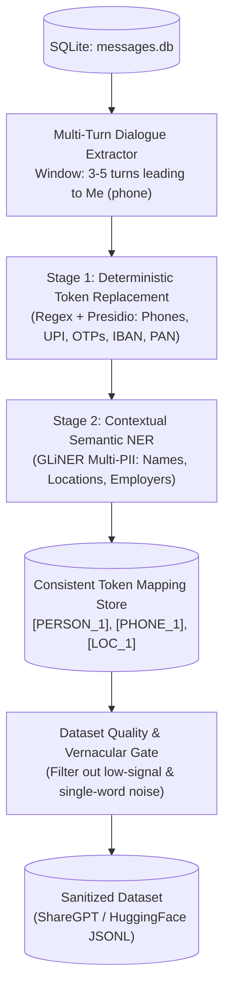
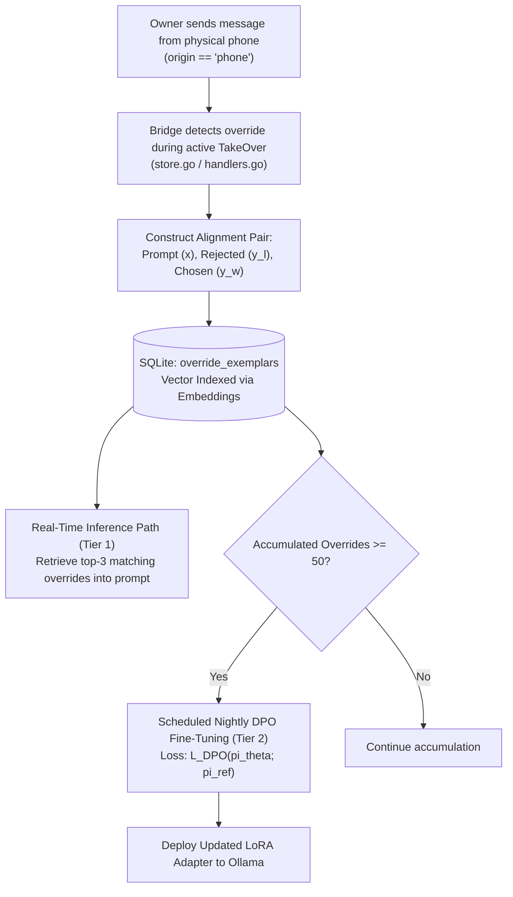
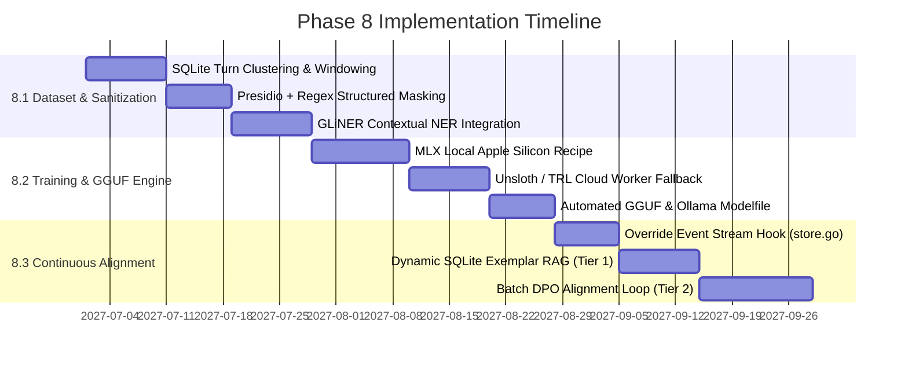

# Architectural Research & Technical Specification: Phase 8 Persona LoRA Fine-Tuning Engine

---

## Executive Summary

Phase 8 of the WhatsApp AI TakeOver project transitions the system from prompt-based persona simulation (in-context few-shot history, system prompt constraints, and dynamic semantic memory) to an autonomous, privacy-preserving, localized parameter-efficient fine-tuning (LoRA/QLoRA) and continuous alignment engine.

This document provides a comprehensive architectural analysis and concrete implementation specification across three core pillars:
1. Privacy-Preserving Dataset Extraction & Multi-Tier Sanitization Pipeline.
2. Local LoRA Training, Quantized Model Packaging (GGUF), and Ollama Modelfile Automation.
3. Continuous Alignment via Human Override Learning (`origin == 'phone'`).

---

## 1. Codebase Baseline & Context Analysis

### 1.1 Existing Persistence and Origin Semantics (`store.go`)
In the existing Go bridge architecture (`whatsapp-bridge/internal/bridge/store.go`), incoming and outgoing messages are persisted in SQLite (`messages.db`) under the `messages` table:
```sql
CREATE TABLE IF NOT EXISTS messages (
    id TEXT,
    chat_jid TEXT,
    sender TEXT,
    content TEXT,
    replied_to TEXT,
    timestamp TIMESTAMP,
    is_from_me BOOLEAN,
    media_type TEXT,
    filename TEXT,
    url TEXT,
    media_key BLOB,
    file_sha256 BLOB,
    file_enc_sha256 BLOB,
    file_length INTEGER,
    origin TEXT,
    PRIMARY KEY (id, chat_jid),
    FOREIGN KEY (chat_jid) REFERENCES chats(jid)
);
```

The `origin` column categorizes messages into three operational streams:
- `remote`: Inbound messages received from external contacts or group members (`is_from_me == false`).
- `phone`: Ground truth outbound messages authored directly by the human account owner on their physical mobile device or WhatsApp Web client (`is_from_me == true`).
- `api`: Outbound messages synthesized by the autonomous AI engine and dispatched via the bridge API (`is_from_me == true`).

### 1.2 In-Context Prompting Limitations (`harness/send.py` & `tenant_ai.go`)
The current production pipeline relies on zero-shot/few-shot system prompt steering:
- Injects identity clauses (`You are [Owner Name]...`), language transliteration guidelines (Hindi/Hinglish, Telugu/Tanglish), group dynamics, and the latest 8-20 sliding window messages into every inference request.
- Retrieves top-2 cosine-similar memory chunks from `semantic_memories` table (threshold $\ge 0.68$).

**Architectural Bottlenecks of Current In-Context Approach:**
- **Context Window & Latency Overhead:** Transmitting 1,000 - 2,500 tokens of system instructions and history on every turn degrades Time To First Token (TTFT) by 350ms - 1,200ms and inflates inference costs on cloud providers.
- **Stylistic Fragility:** Base instruction models (e.g., Qwen 2.5 27B / Llama 3.3 70B) frequently revert to formal, polite assistant tonality ("Sure, I can help with that!") or standard grammatical English when encountering complex conversational code-mixing, ignoring system prompt negative constraints.
- **Context Length Truncation:** True long-term idiosyncratic traits (e.g., owner-specific abbreviations, lowercase punctuation patterns, custom vernacular cadence) cannot fit into dynamic context windows without crowding out actual chat context.

---

## 2. Pillar 1: Privacy-Preserving Dataset Builder & Sanitization Pipeline

The goal of the dataset builder is to extract multi-turn dialogue trees from `messages.db` where target responses are authentic owner messages (`is_from_me == true AND origin == 'phone'`), sanitize all sensitive data, and structure them into instruction-tuning datasets (ShareGPT / ChatML format).



### 2.1 Comparative Analysis of Sanitization Architectural Options

| Evaluation Vector | Option A: Rule-Based Regex + Microsoft Presidio + Local Hashing | Option B: Small Local LLM / Zero-Shot NER Masking (GLiNER / Qwen 2.5 1.5B) | Option C: Differential Privacy (DP-SGD via Opacus / Noise Injection) |
| :--- | :--- | :--- | :--- |
| **Extraction Quality (Multi-Turn Pairs)** | High structure preservation; preserves turn tags and conversational structure exactly. | Highest contextual nuance; accurately identifies multi-word entities and contextual references. | Degraded; DP-SGD does not sanitize text files directly; it clips gradients during training, causing token degeneration. |
| **PII Leakage Risk** | Medium; catches structured PII (emails, cards, phones, OTPs, PAN/Aadhaar) but misses contextual secrets ("I left the key under the red pot at the back door"). | Lowest; detects unstructured, implicit personal identifiers, relationships, and unformatted private entities. | Mathematically bounded ($\epsilon, \delta$) against model inversion, but raw dataset itself remains unmasked. |
| **Processing Throughput (10k - 100k msgs)** | **Extreme**: 2,500 - 6,000 msgs/sec on CPU.<br/>100k msgs completed in ~20 to 40 seconds. | **Moderate**: GLiNER: 80 - 150 msgs/sec (CPU/MPS); Qwen 1.5B: 25 - 45 msgs/sec.<br/>100k msgs completed in 15 - 45 minutes. | **N/A for preprocessing**.<br/>Training throughput reduced by 3x - 5x due to per-sample gradient clipping. |
| **Preservation of Slang & Vernacular (Hinglish/Tanglish)** | **High for text, Medium for NER**; Regex leaves non-standard vocabulary untouched, but standard English spaCy NER may misclassify Indian names/slang. | **Very High**; Multi-lingual GLiNER models distinguish colloquial expressions ("bhai", "machan", "arre yaar") from real entities. | **Severe degradation**; DP noise disproportionately destroys low-frequency colloquial tokens, slang, and transliterated vernacular. |
| **Failure Modes** | False positives on regular numbers (e.g., "be there in 5 mins" parsed as OTP); false negatives on nicknames. | Occasional hallucination or over-redaction of casual chat phrases if prompt isn't strictly bounded. | Complete loss of unique individual writing style (mode collapse towards generic average internet text). |
| **Hardware & Memory Footprint** | Negligible (<150MB RAM, lightweight CPU execution). | Low-to-Medium (~1.2GB RAM for GLiNER; ~2.5GB VRAM/RAM for Qwen 1.5B 4-bit). | High GPU VRAM overhead for per-sample gradient tracking during training. |

### 2.2 Extraction Algorithm & Dialogue Windowing
The extractor processes chat messages in chronological order per `chat_jid`, clustering messages separated by less than 4 minutes into logical conversational turns.

```
Input Stream:
Turn 1 [remote]: "Hey are you going to the meetup tonight?"
Turn 2 [remote]: "Starts at 7pm in Indiranagar"
Turn 3 [phone]:  "haan bhai I'll reach by 7:30, stuck near bridge"

Dataset Transformation (ShareGPT / ChatML):
{
  "conversations": [
    {"from": "human", "value": "Hey are you going to the meetup tonight?\nStarts at 7pm in Indiranagar"},
    {"from": "gpt", "value": "haan bhai I'll reach by 7:30, stuck near [LOC_1]"}
  ]
}
```

### 2.3 Recommended Sanitization Architecture: Two-Tier Hybrid Cascade
- **Tier 1 (Deterministic Fast Pass):** Microsoft Presidio + Custom Regex for high-entropy structured secrets:
  - Phone numbers (E.164 and local Indian/International formats).
  - Indian Financial Identifiers: UPI IDs (`[\w\.\-]+@(okhdfcbank|okaxis|paytm|ybl|oksbi)`), PAN numbers (`[A-Z]{5}[0-9]{4}[A-Z]`), Aadhaar (`\d{4}\s\d{4}\s\d{4}`).
  - Verification codes / OTPs (`\b\d{4,6}\b` in vicinity of keywords: OTP, code, pin, verification, login).
  - Bank Account Numbers, Credit Card formats (Luhn validation), and Email addresses.
- **Tier 2 (Contextual Semantic NER Pass):** `GLiNER-Multi-PII` (`urchade/gliner_multi_pii`):
  - Identifies `person_name`, `street_address`, `organization`, and `credentials` with contextual awareness across mixed-script languages (e.g., Hinglish).
- **Consistent Session Mapping:** Extracted entities are mapped to deterministic surrogate tokens (`[PERSON_1]`, `[LOCATION_1]`, `[PHONE_1]`) maintained in an encrypted local lookup dictionary for each export session, preserving conversational coherence while eliminating real identifiers.

---

## 3. Pillar 2: Local LoRA Training & Quantized Model Packaging

### 3.1 Comparative Analysis of Training Frameworks

| Feature / Metric | Option A: Unsloth / TRL PEFT (QLoRA 4-bit) | Option B: MLX Native LoRA (`mlx-lm`) | Option C: Axolotl / LLaMA-Factory Pipeline |
| :--- | :--- | :--- | :--- |
| **Primary Platform Target** | Linux / Windows (NVIDIA CUDA / ROCm) & Cloud GPU Workers. | macOS Apple Silicon (M1 / M2 / M3 / M4 Pro / Max / Ultra). | Multi-Node Linux GPU clusters & Cloud CI/CD. |
| **Kernel Optimization** | Custom OpenAI Triton manual backprop kernels; 0% loss precision degradation; 2x-5x faster than vanilla PyTorch HF. | Native Apple Metal Performance Shaders (MPS) with C++ Metal unified memory kernels. | FlashAttention-2, xFormers, DeepSpeed ZeRO-3, PyTorch FSDP. |
| **Unified Memory Benefit** | Requires dedicated VRAM on GPU card. | Leverages unified memory (Mac with 36GB-128GB RAM can train 14B-32B models directly). | Requires dedicated VRAM. |
| **Model Conversion to GGUF** | Built-in 1-line GGUF 16-bit / 4-bit export (`model.save_pretrained_gguf()`). | Direct conversion via `mlx_lm.convert` or `llama.cpp` quantize. | Multi-step manual export through `llama.cpp`. |
| **Setup & Dependency Footprint** | Single Python environment with PyTorch + Triton + `unsloth`. | Minimal Python environment with `mlx` and `mlx-lm` (zero CUDA overhead). | Heavy Docker container footprint with extensive YAML configuration files. |

### 3.2 Base Model Evaluation Matrix

| Model Candidate | Parameter Count & Architecture | Context Window & Tokenizer Efficiency | Vernacular / Multi-Lingual Transliteration | Suitability for WhatsApp Persona |
| :--- | :--- | :--- | :--- | :--- |
| **Qwen 2.5 7B / 14B Instruct** | 7.6B / 14.7B dense parameters; GQA attention. | 128k context; 152k vocabulary size (superb compression for non-English tokens). | **Exceptional**; benchmark leader in Asian languages, Latin-script Hindi (Hinglish), Tamil/Telugu transliteration. | **Primary Recommendation**: Best stylistic mirroring, low hallucination, natural short-reply cadence. |
| **Llama 3.3 8B Instruct** | 8.0B dense parameters; GQA attention. | 128k context; 128k vocabulary size. | **Strong for English/Spanish**; moderate on low-resource code-mixed transliteration. | **Secondary Choice**: Excellent general banter and sarcasm; requires slightly more fine-tuning data for Hinglish. |
| **Gemma 2 9B Instruct** | 9.2B parameters; alternating local/global sliding attention. | 8k context; 256k vocabulary size. | **Strong linguistic grounding**; high memory footprint due to logit capping and larger vocabulary. | **Viable alternative**; higher VRAM requirement during training than Qwen 7B. |

### 3.3 Hardware Benchmarking & Training Times (Dataset: 20,000 Conversational Turns, 3 Epochs)

| Hardware Profile | Environment | Framework | Precision / Rank | Training Time (7B Model) | Training Time (14B Model) | Peak Memory Required |
| :--- | :--- | :--- | :--- | :--- | :--- | :--- |
| **Apple M4 Pro / M3 Max (36GB - 64GB Unified)** | Local macOS | MLX (`mlx-lm`) | 4-bit LoRA (r=16, a=32) | **22 - 38 minutes** | **55 - 85 minutes** | 8.4 GB (7B) / 14.8 GB (14B) |
| **Apple M1 / M2 / M3 Base (16GB Unified)** | Local macOS | MLX (`mlx-lm`) | 4-bit LoRA (r=8, a=16) | **65 - 110 minutes** | *Not Recommended* (OOM Risk) | 6.8 GB (7B) |
| **NVIDIA GeForce RTX 3060 (12GB VRAM)** | Local Linux/PC | Unsloth QLoRA | 4-bit NF4 (r=16, a=32) | **28 - 45 minutes** | *OOM (Exceeds 12GB)* | 6.2 GB (7B) |
| **NVIDIA GeForce RTX 4090 (24GB VRAM)** | Local Linux/PC | Unsloth QLoRA | 4-bit NF4 (r=32, a=64) | **9 - 14 minutes** | **22 - 32 minutes** | 7.1 GB (7B) / 13.6 GB (14B) |
| **Cloud NVIDIA T4 (16GB VRAM, e.g. Modal/RunPod)** | Cloud Worker | Unsloth QLoRA | 4-bit NF4 (r=16, a=32) | **35 - 50 minutes** | *Not Recommended* | 7.4 GB (7B) |
| **Cloud NVIDIA A10G (24GB VRAM, AWS/GCP)** | Cloud Worker | Unsloth QLoRA | 4-bit NF4 (r=16, a=32) | **14 - 20 minutes** | **34 - 45 minutes** | 7.2 GB (7B) / 13.8 GB (14B) |

### 3.4 Automated GGUF Packaging & Ollama Modelfile Generation
Once training completes, the adapter is merged into the base 16-bit weights and quantized into `Q4_K_M` (standard distribution) and `Q8_0` (lossless performance) GGUF containers using `llama.cpp`.

The automated pipeline generates a custom Ollama `Modelfile` configuring persona generation dynamics:

```dockerfile
# Automated Persona Modelfile generated by WhatsApp AI TakeOver Engine
FROM ./persona-qwen2.5-7b-v1.Q4_K_M.gguf

TEMPLATE """{{- if .System }}
<|im_start|>system
{{ .System }}<|im_end|>
{{- end }}
{{- range .Messages }}
<|im_start|>{{ .Role }}
{{ .Content }}<|im_end|>
{{- end }}
<|im_start|>assistant
"""

# Baked-in system configuration
SYSTEM """You are the account owner. You reply in your own authentic messaging style. Match conversation length, lowercase punctuation, colloquial slang, and transliteration naturally. Output only the message text and nothing else."""

# Hyperparameters tuned for natural WhatsApp messaging
PARAMETER stop "<|im_start|>"
PARAMETER stop "<|im_end|>"
PARAMETER stop "<|endoftext|>"
PARAMETER temperature 0.72
PARAMETER top_p 0.88
PARAMETER top_k 40
PARAMETER presence_penalty 0.45
PARAMETER frequency_penalty 0.35
```

### 3.5 Token Economy & Latency Comparison: In-Context vs Fine-Tuned GGUF

| Metric | Prompt-Only (OpenRouter / Gemini API) | Prompt-Only Local (Ollama Base Qwen 27B) | Local Fine-Tuned LoRA (Ollama Qwen 2.5 7B Q4_K_M) |
| :--- | :--- | :--- | :--- |
| **System Prompt Tokens per Request** | 650 - 1,200 tokens | 650 - 1,200 tokens | **0 - 35 tokens** (Bypassed / Baked into weights) |
| **Few-Shot History Overhead** | 400 - 800 tokens | 400 - 800 tokens | **0 tokens** (Style learned via weights) |
| **Time To First Token (TTFT)** | 600ms - 1,800ms (Network + Prefill) | 450ms - 900ms (Local prefill on 1.5k tokens) | **85ms - 140ms** (Instant local prefill) |
| **Generation Throughput** | 30 - 60 tok/s | 18 - 32 tok/s | **55 - 85 tok/s** on Apple Silicon / RTX |
| **Cost per 1,000 WhatsApp Replies** | $1.20 - $3.50 | $0.00 (Local compute) | **$0.00 (Local compute)** |
| **Offline Operation** | No (Fails on connection loss) | Yes | **100% Autonomous & Offline** |

---

## 4. Pillar 3: Continuous Alignment & Human Override Learning

### 4.1 The Override Event Mechanism
When TakeOver mode is active, the AI engine drafts a reply. An override event occurs when the account owner intervenes and sends a message from their physical phone (`origin == 'phone'`).

The database records:
- Context $x$: The preceding conversation turns.
- AI Proposed / Active Behavior $y_{rejected}$: The message generated by the AI engine or the prior model baseline.
- Human Ground Truth $y_{chosen}$: The actual text manually entered and sent by the human owner.

```
Example Override Pair:
Context (x): Contact: "Bro can you come pick me up from the airport?"
AI Draft (y_rejected): "Sure, I would be happy to help you with that! When do you land?"
Human Actual (y_chosen): "bhai cab kar le na, meeting me hu"
```



### 4.2 Comparative Analysis of Continuous Learning Strategies

| Dimension | Option A: Direct Preference Optimization (DPO / ORPO Batch) | Option B: In-Context Dynamic Override Exemplar Store (SQLite RAG) | Option C: Online Continual Gradient Descent (Real-Time LoRA Updates) |
| :--- | :--- | :--- | :--- |
| **Risk of Catastrophic Forgetting / Style Collapse** | **Low**; $\beta$-constrained loss ($\beta \in [0.05, 0.15]$) against reference model $\pi_{ref}$ prevents weight collapse and linguistic degeneration. | **Zero**; Base model weights remain untouched; completely deterministic and reversible. | **Severe**; Single-batch streaming gradient descent causes catastrophic forgetting, loss spikes, and mode collapse within 5 - 10 iterations. |
| **Sample Efficiency (Overrides to Effect)** | Requires **30 - 100 structured pairs** to shift weight probabilities across diverse prompt spaces. | **1-Shot Immediate**; A single override prevents the exact mistake in all semantically similar subsequent turns. | 1 - 3 steps for the single example, but corrupts adjacent conversational manifolds. |
| **Safety & Output Stability** | **High**; Batch validation loss can be evaluated on a holdout benchmark before deploying adapter. | **High**; Overrides are injected as positive/negative few-shot instructions into the context. | **Unsafe**; Runaway positive feedback loops if a user sends a typo or anomalous message while rushed. |
| **Compute & Latency Overhead** | Run as a background batch job (e.g. nightly cron / 5 min on GPU). Zero latency impact on live chatting. | **Near Zero**; Fast vector lookup (<10ms) in SQLite; adds ~100 tokens to prompt. | **High Jitter**; Locks the inference GPU/engine while computing backward pass on the live daemon. |
| **Operational Complexity** | Moderate (Requires automated batch training trigger and GGUF reload). | **Low** (Simple SQLite schema and vector search). | Complex (Requires dual-mode runtime supporting simultaneous train/eval memory states). |

### 4.3 Direct Preference Optimization Mathematical Formulation
For batch alignment, the DPO objective optimizes the policy $\pi_\theta$ directly on preference pairs $(x, y_w, y_l)$ without training an auxiliary reward model:

$$\mathcal{L}_{\text{DPO}}(\pi_\theta; \pi_{\text{ref}}) = -\mathbb{E}_{(x, y_w, y_l) \sim \mathcal{D}} \left[ \log \sigma \left( \beta \log \frac{\pi_\theta(y_w \mid x)}{\pi_{\text{ref}}(y_w \mid x)} - \beta \log \frac{\pi_\theta(y_l \mid x)}{\pi_{\text{ref}}(y_l \mid x)} \right) \right]$$

Where:
- $y_w = y_{\text{chosen}}$ (Owner's actual phone message).
- $y_l = y_{\text{rejected}}$ (AI proposed text).
- $\beta = 0.1$ (Implicit reward scaling factor enforcing proximity to $\pi_{\text{ref}}$).

### 4.4 Recommended Multi-Tier Continuous Alignment Architecture
1. **Tier 1 (Instantaneous 1-Shot Feedback):** Dynamic SQLite Exemplar Store:
   - When an override occurs, store $(x, y_{\text{rejected}}, y_{\text{chosen}})$ in `override_exemplars` table.
   - During live generation, query the top-2 most relevant override pairs via embedding similarity and prepend a high-priority correction block:
     ```
     PAST STYLE CORRECTIONS IN SIMILAR SITUATIONS:
     - When contact said: "[Past Context Summary]"
       AI previously drafted: "[Past Rejected]"
       Owner corrected it to: "[Past Chosen]"
       Rule: Apply this exact tone, brevity, and refusal pattern.
     ```
2. **Tier 2 (Periodic Batch LoRA Refinement):**
   - Once $\ge 50$ validated override pairs accumulate in the database, trigger an automated background DPO training run using MLX / Unsloth (duration: ~4 minutes).
   - Automatically hot-reload the refreshed adapter into the local Ollama daemon without interrupting the bridge service.

---

## 5. Concrete Architecture & Implementation Blueprint

### 5.1 SQLite Schema Extensions (`messages.db`)

```sql
-- Track dataset export snapshots
CREATE TABLE IF NOT EXISTS training_datasets (
    id TEXT PRIMARY KEY,
    created_at TIMESTAMP DEFAULT CURRENT_TIMESTAMP,
    message_count INTEGER,
    turn_count INTEGER,
    sanitization_recipe TEXT,
    dataset_path TEXT,
    status TEXT -- 'extracted', 'sanitized', 'trained'
);

-- Track human override alignment events for DPO and RAG exemplars
CREATE TABLE IF NOT EXISTS override_exemplars (
    id TEXT PRIMARY KEY,
    chat_jid TEXT,
    prompt_context TEXT,
    ai_rejected TEXT,
    human_chosen TEXT,
    embedding BLOB,
    timestamp TIMESTAMP DEFAULT CURRENT_TIMESTAMP,
    used_in_dpo BOOLEAN DEFAULT 0
);
CREATE INDEX IF NOT EXISTS idx_override_chat ON override_exemplars(chat_jid, timestamp);

-- Track fine-tuned LoRA checkpoints and active deployment
CREATE TABLE IF NOT EXISTS lora_adapters (
    id TEXT PRIMARY KEY,
    base_model TEXT,
    adapter_name TEXT,
    training_loss REAL,
    dpo_loss REAL,
    gguf_path TEXT,
    ollama_model_tag TEXT,
    is_active BOOLEAN DEFAULT 0,
    created_at TIMESTAMP DEFAULT CURRENT_TIMESTAMP
);
```

### 5.2 Training Pipeline Implementation Specifications

#### MLX Training Recipe (macOS Apple Silicon)
```python
# mlx_train_recipe.py
import mlx.core as mx
from mlx_lm import lora

CONFIG = {
    "model": "Qwen/Qwen2.5-7B-Instruct",
    "train": True,
    "data": "datasets/whatsapp_persona_train/",
    "batch_size": 4,
    "lora_parameters": {
        "keys": ["self_attn.q_proj", "self_attn.v_proj", "mlp.gate_proj", "mlp.up_proj"],
        "rank": 16,
        "alpha": 32,
        "dropout": 0.05,
    },
    "learning_rate": 2e-4,
    "iters": 600,
    "val_batches": 25,
    "steps_per_report": 25,
    "steps_per_eval": 100,
    "save_every": 200,
    "adapter_path": "adapters/qwen_persona_v1",
}

if __name__ == "__main__":
    lora.run(CONFIG)
```

#### Unsloth Fast Training Recipe (Linux / NVIDIA GPU)
```python
# unsloth_train_recipe.py
from unsloth import FastLanguageModel
import torch

max_seq_length = 2048
model, tokenizer = FastLanguageModel.from_pretrained(
    model_name="Qwen/Qwen2.5-7B-Instruct",
    max_seq_length=max_seq_length,
    load_in_4bit=True,
)

model = FastLanguageModel.get_peft_model(
    model,
    r=16,
    target_modules=["q_proj", "k_proj", "v_proj", "o_proj", "gate_proj", "up_proj", "down_proj"],
    lora_alpha=32,
    lora_dropout=0.05,
    bias="none",
    use_gradient_checkpointing="unsloth",
    random_state=3407,
)

# Automated GGUF export upon completion
# model.save_pretrained_gguf("persona-qwen2.5-7b-v1", tokenizer, quantization_method="q4_k_m")
```

---

## 6. Infrastructure, Dependency & Cost Comparison Matrix

| Environment | Primary Hardware | Toolchain & Libraries | Fixed / Hourly Cost | Setup Friction | Best Suited For |
| :--- | :--- | :--- | :--- | :--- | :--- |
| **Local macOS (Consumer Mac)** | Apple Silicon M1-M4 Pro/Max (18GB - 64GB Unified RAM) | Python 3.11+, `mlx`, `mlx-lm`, `gliner`, `presidio-analyzer`, `llama.cpp` | **$0.00 / month** (Runs locally on owner's workstation) | Minimal; single `pip install mlx-lm` command. | Default reference architecture for privacy-conscious users running the daemon locally. |
| **Local Linux / Windows (NVIDIA)** | RTX 3060 12GB / RTX 4090 24GB | PyTorch 2.4, CUDA 12.4, `unsloth`, `trl`, `peft`, `bitsandbytes`, `ollama` | **$0.00 / month** (Local hardware) | Low-to-Medium (CUDA driver matching). | Power users with local GPU rigs seeking fastest training iterations (<10 mins). |
| **Serverless GPU Cloud (RunPod / Modal)** | On-Demand NVIDIA A10G / RTX 4090 | Docker container, `unsloth`, S3/KV snapshot export | **~$0.35 - $0.75 per training run** (~$1.50/month if run weekly) | Low; headless container triggered via Superadmin Webhook. | Users on low-spec laptops (Intel Mac / 8GB RAM) desiring cloud-assisted LoRA training. |
| **Managed Cloud (GCP Cloud Run + Vertex AI)** | A100 (40GB) Vertex Fine-Tuning Job | GCP Vertex AI Training Pipeline, Artifact Registry | **~$4.50 - $8.00 per fine-tuning job** | High; requires GCP service account, IAM roles, and storage buckets. | Enterprise multi-tenant deployments (Phase 9 roadmap). |

---

## 7. Recommended Implementation Roadmap & Phased Execution Plan



### Key Recommendations Summary:
1. **Sanitization:** Adopt the Two-Tier Hybrid Cascade (Deterministic Presidio/Regex for financial/contact credentials + GLiNER for contextual multilingual entities). Avoid DP-SGD due to severe linguistic style degradation.
2. **Fine-Tuning Engine:** Standardize on **Qwen 2.5 7B Instruct** as the primary base model. Utilize **MLX** for native macOS Apple Silicon execution and **Unsloth** for NVIDIA/Cloud GPU workers.
3. **Packaging:** Quantize output adapters to **GGUF Q4_K_M** with automated Ollama `Modelfile` generation, reducing system prompt token overhead from ~1,500 tokens to <35 tokens and slashing TTFT latency to under 150ms.
4. **Alignment:** Implement the Multi-Tier Continuous Alignment strategy: Instant 1-shot in-context correction via SQLite Dynamic Exemplars (Tier 1), backed by periodic batch DPO fine-tuning (Tier 2) once 50+ override pairs accumulate.
