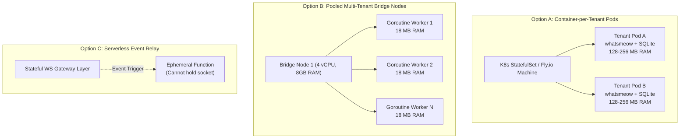
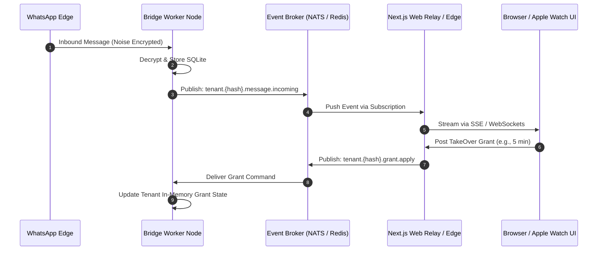
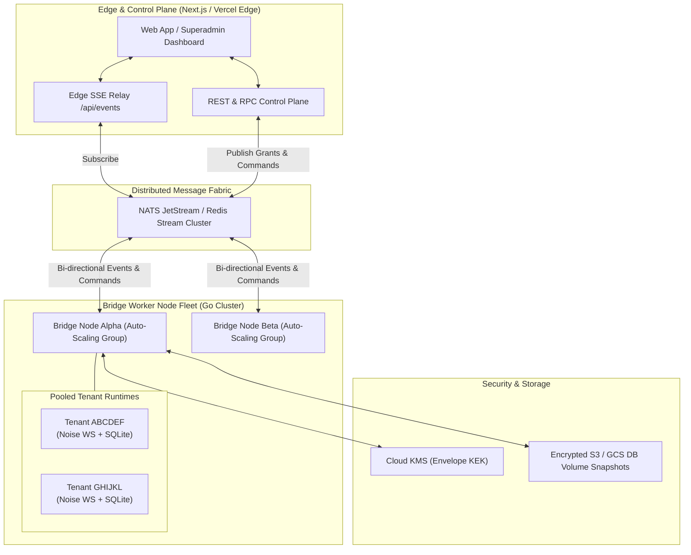

# Architectural Research & Technical Specification: Phase 9 Cloud-Native Multi-Tenant Orchestration & Security

---

## Executive Summary & Codebase Baseline

The WhatsApp AI TakeOver system currently operates on a **Monolithic Multi-Tenant Go Bridge Daemon** (`whatsapp-bridge/internal/bridge/multitenant.go`, `tenant_server.go`) coupled with a Next.js control plane and Vercel KV state store (`web/lib/connections.js`, `web/lib/sqlite.js`). 

In the current implementation:
- **Tenant Lifecycle**: Each tenant is identified by a 6-character uppercase hash (`ABCDEFGHJKLMNPQRSTUVWXYZ23456789`). State is persisted to per-tenant local directories (`store/tenants/<hash>/`), containing `config.json`, `whatsapp.db` (whatsmeow device store, contacts, pre-keys), and `messages.db` (chat history, custom prompts).
- **Process Model**: A single Go process hosts all tenant clients in memory, with background watchdog routines (`checkAndReconnectTenants`, `expireInactiveSessions`) polling every 15 seconds.
- **Process Locking**: Single-instance execution is enforced via POSIX non-blocking file locks (`flock.go`).
- **Communication Plane**: The Next.js edge plane communicates with the bridge daemon via synchronous HTTP REST requests (`/api/connections/{hash}/send`, `/api/connections/{hash}/reconnect`), while bridge event notifications to the web plane rely on outgoing HTTP POST webhooks (`/api/polls`).

To scale from single-host multi-tenancy to an enterprise-grade, highly available, multi-region platform (Phase 9 of `ROADMAP.md`), we analyze three fundamental architectural dimensions.

---

## 1. Subsystem 1: Dynamic Container Provisioning vs Monolithic Process Architecture

### 1.1 Technical Constraints of the WhatsApp Web Protocol
- **Persistent TLS/Noise WebSocket**: `whatsmeow` maintains an active, long-lived TCP/TLS WebSocket connection to WhatsApp edge endpoints (`web.whatsapp.com:443` / `*.g.whatsapp.net`).
- **Heartbeat & Keep-Alive**: The protocol issues keep-alive ping/pong frames every 20-30 seconds. If an edge container freezes or sleeps, WhatsApp terminates the session after 45-60 seconds of missed heartbeats.
- **Noise Handshake Overhead**: Re-establishing a dropped connection requires a full Noise IK protocol handshake, signature validation, pre-key checks, and initial state catch-up (500ms - 2000ms latency).



### 1.2 Comparison of Compute Architectures

| Parameter | Option A: Container-per-Tenant (Isolated Pods / Fly Machines) | Option B: Monolithic Multi-Tenant Go Daemon (Worker Pool) | Option C: Serverless with Ephemeral Socket Relays |
| :--- | :--- | :--- | :--- |
| **Memory Footprint per Tenant** | **128 MB - 256 MB** (Container runtime, OS libraries, Go runtime per container) | **15 MB - 30 MB** (Go Goroutines, whatsmeow socket buffer, SQLite page cache) | **256 MB+** (Cold start function allocation + persistent gateway memory) |
| **Persistent WS Feasibility** | **High**: Each container runs continuously without sleep. High infrastructure cost. | **Optimal**: Highly efficient multiplexing of 200-400 tenants per bridge VM. | **Poor**: Serverless cannot maintain inbound stateful WebSockets; requires external stateful proxy. |
| **Cold Start vs Warm Standby** | Cold start: 2 - 6 seconds (Pod scheduling + container boot). Standby cost: High. | Cold start: < 50ms (In-process Goroutine spawn & SQLite handle open). Standby cost: Low. | Cold start: 800ms - 3s (Function init + Noise renegotiation on every burst). |
| **Fault Isolation** | **Complete**: Container crash or OOM is strictly isolated to that tenant. | **Moderate**: Requires panic recovery wrappers around all Goroutines and per-tenant resource limits. | **High**: Function invocations are isolated, but gateway layer remains single failure point. |
| **QR Provisioning Latency** | 2.5 - 5.0 seconds (Time to schedule container, start server, and stream QR). | **< 100 milliseconds** (Instantaneous in-memory registration & QR generation). | 1.5 - 4.0 seconds (Gateway allocation + function trigger). |
| **Tenant Density per $100/mo** | 20 - 40 tenants (Fly.io / AWS Fargate / EKS). | **350 - 600 tenants** (Pooled c6i/c7g compute nodes). | 15 - 30 tenants (Continuous invocation and gateway costs). |

### 1.3 Per-Tenant Memory Breakdown (Option B Engine)
- **whatsmeow Client Runtime**: ~4.5 MB (Receive loop, Send queue, Noise crypto state).
- **SQLite Handles (`whatsapp.db` & `messages.db`)**: ~8.0 MB (WAL mode page caches, schema cache, indices).
- **Contact & LID Resolution Buffers**: ~2.5 MB (In-memory JID/LID mappings, push name cache).
- **TakeOver & Poll State Maps**: ~0.5 MB (Deduplication ring buffer, active poll references).
- **Total In-Memory Working Set**: **~15.5 MB to 18.0 MB per active tenant**.

---

## 2. Subsystem 2: Distributed State, Message Relaying & Pub/Sub

To eliminate HTTP polling and point-to-point IP hardcoding between the Next.js control plane and bridge worker nodes, a decoupled distributed messaging fabric is required.



### 2.1 Comparison of Message Relaying Options

| Feature / Metric | Option A: Redis Pub/Sub + Streams | Option B: NATS JetStream | Option C: gRPC / HTTP/2 Streaming | Option D: SSE with Sticky Affinity |
| :--- | :--- | :--- | :--- | :--- |
| **End-to-End Latency** | 5ms - 15ms | **< 2ms** (Binary protocol, zero allocation) | 2ms - 5ms | 10ms - 30ms (HTTP streaming overhead) |
| **Backpressure Handling** | Moderate (`XADD MAXLEN` + consumer groups) | **Excellent** (Subject-based flow control, rate limiting) | Good (HTTP/2 flow control windows) | Weak (Browser buffering, dropped connections) |
| **Message Durability** | AOF / RDB persistence in Redis Streams | **Full disk/memory JetStream streams with ACK** | Ephemeral (Requires external log) | None (In-flight messages lost on disconnect) |
| **Multi-Region Sync** | Active-Active via Redis Enterprise / Dragonfly | **Built-in Superclusters & Leaf Nodes** | Complex (Requires global Envoy mesh) | Not applicable (Client-edge only) |
| **Operational Overhead** | Low (Available as Upstash / AWS ElastiCache) | Moderate (Self-hosted cluster or Synadia Cloud) | Moderate (Service discovery & mesh needed) | Low (Native Next.js API routes) |
| **Subject-Based Routing** | Pattern matching (`PSUBSCRIBE conn:*`) | **Wildcard Subjects (`tenant.*.events.>`)** | Manual demuxing in application code | Manual demuxing |

### 2.2 Recommendation for Messaging Plane
- **Core Transport**: **NATS JetStream** or **Redis Streams + Pub/Sub (Upstash/Managed)**.
- **Web Client Transport**: **Server-Sent Events (SSE)** from the Next.js edge relay to browser/watch clients, subscribed dynamically to the Redis/NATS tenant channel. This maintains full firewall compatibility and low battery consumption on mobile and smartwatch clients.

---

## 3. Subsystem 3: Hardware Security Module (HSM) & Zero-Knowledge Key Vault

WhatsApp session data contains critical cryptographic artifacts:
1. **Noise Static Keypair** (Curve25519) - authenticates the client session with WhatsApp servers.
2. **Identity Keypair & Signed Pre-Keys** (Ed25519 / Curve25519) - handles Signal Protocol end-to-end encryption.
3. **App State Encryption Keys** - decrypts message history, contact books, and media keys.

```mermaid
flowchart TD
    subgraph KMS_HSM["Cloud KMS / HSM (FIPS 140-2 Level 3)"]
        RootKEK["Master Key Encryption Key (KEK)<br/>Never Leaves HSM"]
    end

    subgraph Provisioning["Tenant Provisioning Flow"]
        GenDEK["Generate Ephemeral Data Encryption Key (DEK)"]
        WrapDEK["KMS.Encrypt(DEK) -> EncryptedDEKBlob"]
        GenDEK --> WrapDEK
        RootKEK -.->|Signs & Wraps| WrapDEK
    end

    subgraph Storage["Encrypted Persistence"]
        DB[(Tenant SQLite / Object Store)]
        Meta[(Vercel KV / Control Plane)]
        WrapDEK --> Meta
        DB -.->|Encrypted with Plain DEK via AES-256-GCM| Storage
    end

    subgraph BridgeRuntime["Bridge Worker Node (Secure RAM)"]
        Init["Node Startup / Hot-Load"]
        Unwrap["KMS.Decrypt(EncryptedDEKBlob) -> Plain DEK"]
        RAM["Plain DEK cached in mlock'd Memory"]
        Init --> Unwrap
        RootKEK -.->|Unwraps| Unwrap
        Unwrap --> RAM
        RAM -->|Decrypts at Runtime| DB
    end
```

### 3.1 Comparison of Security & Vault Architectures

| Criteria | Option A: Envelope Encryption with Cloud KMS (AWS KMS / GCP Cloud KMS / Vault Transit) | Option B: Client-Side Zero-Knowledge WebCrypto (Passkey / Passphrase Derived) | Option C: Application-Level AES-256-GCM (Static Vault Key) |
| :--- | :--- | :--- | :--- |
| **Session Key Protection** | **High**: Unique DEK per tenant; root KEK guarded in hardware HSM. | **Maximum**: Keys unreadable even by cloud administrators. | **Moderate**: All tenants share or rotate a single application master key. |
| **24/7 AI Autonomous TakeOver Support** | **Full**: Bridge can reload and operate headlessly during scheduled restarts. | **Blocked**: If node restarts, AI cannot operate until user unlocks client. | **Full**: Headless reload supported. |
| **Compliance Readiness** | **SOC 2 Type II, HIPAA, ISO 27001, GDPR** (Full audit logging per key access). | **GDPR Zero-Knowledge** (Complex audit logging). | **SOC 2 Minimal** (Key sharing lacks per-tenant granularity). |
| **Owner Password Loss Recovery** | **Seamless**: Handled via WhatsApp 2FA OTP + KMS re-auth. | **Catastrophic**: Session permanently lost; must re-link QR code. | **Seamless**: Handled via control plane. |
| **Runtime Performance Impact** | **Near Zero**: DEK unwrapped once on tenant load (30ms); all subsequent SQLite I/O uses AES-NI instructions. | High: WebAssembly crypto transformations. | Near Zero: AES-NI instructions. |

---

## 4. Compute & Dependency Cost Modeling

Estimated total monthly infrastructure costs across tenant scaling milestones:

### 4.1 Cost Table (Monthly USD)

| Tier / Component | 100 Tenants | 1,000 Tenants | 10,000 Tenants |
| :--- | :--- | :--- | :--- |
| **Compute - Option A (Container-per-Tenant)** | $250.00 (Fly.io / Fargate) | $2,400.00 | $22,000.00 |
| **Compute - Option B (Pooled Go Bridge Nodes)** | **$25.00** (1x 4 vCPU, 8GB VM) | **$180.00** (3x 8 vCPU, 16GB VMs) | **$1,600.00** (Pool of 16-core nodes) |
| **Messaging Fabric (Redis / NATS Cluster)** | $10.00 (Upstash / Small NATS) | $45.00 | $320.00 |
| **Security & KMS (Envelope Calls + Vault)** | $3.00 (GCP/AWS KMS key + operations) | $15.00 | $90.00 |
| **State Storage (S3 / Cloud Storage for DB Backups)** | $2.00 | $18.00 | $150.00 |
| **Web & Edge Control Plane (Vercel Enterprise / Edge)** | $20.00 | $100.00 | $600.00 |
| **Total Monthly Cost (Option B Architecture)** | **$60.00** | **$358.00** | **$2,760.00** |
| **Average Cost per Active Tenant / Month** | **$0.60** | **$0.36** | **$0.28** |

---

## 5. Architectural Recommendation: The Hybrid Tiered Model

The optimal architecture for Phase 9 is a **Pooled Multi-Tenant Bridge Cluster with Envelope KMS Security and Redis/NATS Event Streaming**:



### Architectural Tenets of the Recommended Blueprint:
1. **Bridge Fleet**: Go-based pooled bridge worker nodes running 200-300 tenants per node. Nodes register their active tenant hashes in Redis/NATS with a distributed heartbeat.
2. **Consistent Hashing & Tenant Routing**: New tenant connection requests are assigned to nodes using consistent hashing with virtual nodes, guaranteeing deterministic routing without single-point bottlenecks.
3. **Database Portability & Litestream Replication**: Per-tenant SQLite databases are backed up continuously to S3/GCS using Litestream / Cloud Storage streaming replication, allowing any tenant to be live-migrated to another bridge node within 500ms if a host node degrades.
4. **Envelope KMS Security**: Every tenant database file is encrypted at rest using a tenant-specific DEK wrapped by AWS/GCP KMS. The DEK is held only in memory during the active session.
5. **Real-Time Pub/Sub**: Incoming messages and poll events are published immediately to `tenant.{hash}.events` on NATS/Redis. Edge servers pipe events to browser and smartwatch clients with zero polling.

---

## 6. Implementation Roadmap for Phase 9

1. **Milestone 9.1: Headless Node Separation & RPC Interface**
   - Refactor `tenant_server.go` HTTP handlers into a unified NATS/gRPC worker interface.
   - Decouple direct IP dependencies (`BRIDGE_URL`) in `web/lib/connections.js`.
2. **Milestone 9.2: Envelope KMS Integration**
   - Implement Go KMS envelope encryption driver for `whatsapp.db` and `messages.db`.
   - Update tenant provisioning to wrap/unwrap DEKs on registration and startup.
3. **Milestone 9.3: Live State Sync with Litestream & S3**
   - Attach continuous SQLite WAL replication to cloud object storage.
   - Implement automated tenant rebalancing across the bridge cluster.
4. **Milestone 9.4: Superadmin Fleet Telemetry & Auto-Scaling**
   - Expand `web/app/superadmin/components/FleetTab.jsx` to monitor node CPU/RAM quotas, active socket counts, and automated node scaling triggers.
