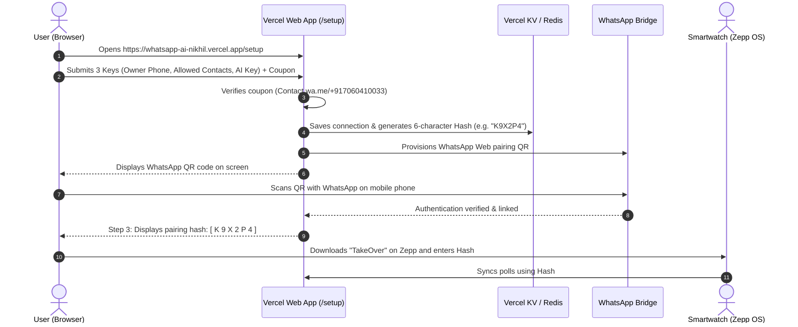
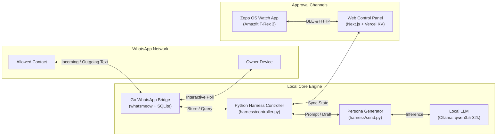

# WhatsApp AI & TakeOver System

An autonomous, self-hosted WhatsApp AI texting companion and [Model Context Protocol (MCP)](https://modelcontextprotocol.io/) server that mirrors your personal texting persona with **multi-channel permission gating** (Native WhatsApp Polls, Zepp OS Smartwatch, and Web Dashboard).

---

## 🌟 Highlights

* **🎭 Persona & Style Mimicking**: Uses local LLMs (via Ollama or OpenAI-compatible APIs like `qwen3.5-32k`) trained on your chat history to mirror your tone, sentence length, capitalization, slang, and emojis.
* **🧠 Adaptive Thinking Engine**: Automatically toggles between **Fast Mode** (quick 1-liner replies) and **Deep Thinking Mode** (contextual multi-step reasoning) based on incoming message complexity.
* **🌐 Web Setup & 6-Char Hash Pairing**: Configure your connection via a clean browser UI, scan a WhatsApp QR code, and receive a 6-character code to pair with your smartwatch.
* **🛡️ Multi-Channel Approval Gating**:
  * **Native WhatsApp Polls**: Get an interactive poll on your phone (`Send 1 text`, `5 minutes`, `2 hours`, `Deny`).
  * **Zepp OS Smartwatch App**: Enter your pairing code and approve/deny requests right from your wrist (Amazfit T-Rex 3 / Zepp OS 4.0).
  * **Next.js Web Control Panel**: Cloud relay and web dashboard backed by Vercel KV / Redis.
* **🛑 Automatic Human Override**: Picking up your phone and manually texting an allowed contact immediately revokes the AI's grant and sends you a confirmation notification.
* **🔌 Full Model Context Protocol (MCP) Server**: Provides standardized tools for Claude Desktop, Cursor, and other agent frameworks to read chats, download media, search contacts, and send messages.

---

## 📱 User Onboarding & Pairing Flow



For a comprehensive walkthrough of the onboarding architecture, see [docs/ONBOARDING_FLOW.md](./docs/ONBOARDING_FLOW.md).

---

## 🏗️ Architecture Overview



For full technical specifications, database schemas, and protocol details, see [ARCHITECTURE.md](./ARCHITECTURE.md).

---

## 📁 Repository Structure

```
.
├── harness/                  # AI Controller & Persona Texting Harness
│   ├── controller.py         # Real-time message watcher & permission manager
│   ├── send.py               # Persona generator, floor control & Ollama client
│   └── controller_state.json # Runtime state machine file
├── whatsapp-bridge/          # Go Bridge (WhatsApp Multi-Device API)
│   ├── main.go               # whatsmeow client, SQLite storage & HTTP server
│   └── store/                # Local SQLite databases (messages.db, whatsapp.db)
├── whatsapp-mcp-server/      # FastMCP Python Server
│   ├── main.py               # MCP Tool definitions (Claude / Cursor interface)
│   ├── whatsapp.py           # Python DB & API client for WhatsApp bridge
│   └── audio.py              # Audio / voice note transcoding utilities
├── zepp/                     # Smartwatch Frontend (Zepp OS 4.0 / Amazfit)
│   ├── app.json              # Zepp OS app manifest (T-Rex 3 target)
│   ├── page/                 # Watch UI & tactile layout (480x480 round)
│   └── app-side/             # Phone-side companion service (ZML BLE bridge)
├── web/                      # Cloud Relay & Web Control Panel
│   ├── app/                  # Next.js App Router (UI & API routes)
│   ├── app/setup/            # 3-Step Web Setup & Pairing Portal
│   └── lib/polls.js          # Vercel KV / Redis poll state management
├── docs/                     # Detailed architectural & setup documentation
│   └── ONBOARDING_FLOW.md    # Step-by-step connection & pairing guide
├── opencode.json             # Model configuration (OpenAI-compatible / Ollama)
├── ARCHITECTURE.md           # Deep architectural specification
└── README.md
```

---

## 🚀 Quick Start

### 1. Prerequisites

* **Go** (1.21+)
* **Python** (3.10+) and [**uv**](https://astral.sh/uv/) (`curl -LsSf https://astral.sh/uv/install.sh | sh`)
* **Node.js** (18+)
* **Ollama** running locally (`ollama pull qwen3.5-32k`) or an OpenAI-compatible API key
* **FFmpeg** *(optional, for WhatsApp voice audio note transcoding)*

---

### 2. Environment Configuration

Create a `.env` file in the root directory:

```bash
cp .env.example .env
```

Configure your numbers (country code without `+`):

```env
# Your personal phone number that receives approval polls
OWNER_PHONE=917060410033

# Comma-separated list of contact numbers permitted for AI take-over
ALLOWED_RECIPIENTS=917893472546,14155550199
```

---

### 3. Start the WhatsApp Bridge

```bash
cd whatsapp-bridge
go run main.go
```

* On first run, a **QR code** will appear in your terminal (or via the `/setup` web portal).
* Open WhatsApp on your phone $\rightarrow$ **Linked Devices** $\rightarrow$ **Link a Device** and scan the QR code.
* The bridge connects via `whatsmeow`, starts syncing messages to `store/messages.db`, and exposes local HTTP endpoints on port `8080`.

---

### 4. Run the AI Take-Over Controller

From the repository root:

```bash
uv run harness/controller.py --interval 2.0 --model qwen3.5-32k
```

**How it operates**:
1. Monitors incoming texts from numbers in `ALLOWED_RECIPIENTS`.
2. When a text arrives, sends a WhatsApp poll to `OWNER_PHONE`.
3. When you vote (`Send 1 text`, `5 minutes`, or `2 hours`), it generates and sends human-like replies mirroring your texting habits.
4. If you text the contact directly from your phone, it immediately aborts autonomy.

You can also run one-off drafts directly:

```bash
# Draft a reply without sending
uv run harness/send.py 917893472546 --draft-only

# Generate and send a reply directly
uv run harness/send.py 917893472546 --model qwen3.5-32k
```

---

### 5. Web Onboarding & Smartwatch Setup Flow

1. **Start the Next.js Web App**:
   ```bash
   cd web
   npm install
   npm run dev
   ```
2. **Access Setup**: Open `http://localhost:3000/setup` in your browser.
3. **Enter Details & Coupon**:
   * Supply `OWNER_PHONE`, `ALLOWED_RECIPIENTS`, and `AI_API_KEY`.
   * Enter your access coupon (Contact [wa.me/+917060410033](https://wa.me/+917060410033) for a coupon).
4. **Scan WhatsApp QR**: Scan the on-screen QR code to authenticate the bridge session.
5. **Get Pairing Hash**: Copy the 6-character pairing code (e.g. `K9X2P4`).
6. **Pair Smartwatch**:
   * Open the **TakeOver** app on your Amazfit smartwatch (Zepp OS 4.0).
   * Enter the 6-character pairing code to link your watch directly to your take-over polls.

---

## 🔌 Connecting to Claude Desktop / Cursor (MCP)

To use WhatsApp as a Model Context Protocol tool in Claude Desktop or Cursor:

Add to `claude_desktop_config.json` or `~/.cursor/mcp.json`:

```json
{
  "mcpServers": {
    "whatsapp": {
      "command": "uv",
      "args": [
        "--directory",
        "/ABSOLUTE/PATH/TO/whatsapp-mcp/whatsapp-mcp-server",
        "run",
        "main.py"
      ]
    }
  }
}
```

### Available MCP Tools:
* `list_messages`: Search messages with date range, query, and context filters.
* `list_chats` / `get_chat`: Query active chats and metadata.
* `search_contacts`: Find contacts by name or number.
* `send_message`: Send messages to phone numbers or group JIDs.
* `send_file` / `send_audio_message`: Send images, videos, documents, or voice notes.
* `download_media`: Download media files from messages locally.

---

## 🔒 Security & Privacy

* **Local-First & Scoped**: All WhatsApp credentials and SQLite databases remain strictly on your local infrastructure.
* **Granular Whitelist**: The AI controller will **never** interact with contacts outside `ALLOWED_RECIPIENTS`.
* **Explicit Grants**: The AI will never send a message without an active, explicit grant from you.
* **Instant Revocation**: Any manual interaction on your phone instantly terminates AI autonomy.

---

## 📄 License

This project is licensed under the [MIT License](./LICENSE).
