# WhatsApp AI & TakeOver System: Product & Engineering Roadmap

This document outlines the strategic roadmap for the **WhatsApp AI & TakeOver System**, tracking completed foundation milestones and defining upcoming architectural, AI, and platform initiatives.

---

## 1. System Maturity & Milestone Overview

```mermaid
flowchart LR
    subgraph CompletedFoundation["Completed Foundation (Phases 0 - 3)"]
        F0["Phase 0<br/>Bridge & SQLite Core"] --> F1["Phase 1<br/>TakeOver & Poll Gating"]
        F1 --> F2["Phase 2<br/>Semantic Memory Engine"]
        F2 --> F3["Phase 3<br/>Web Client & 2FA Plane"]
    end

    subgraph NearTerm["Near-Term (Q3 - Q4 2026)"]
        P4["Phase 4<br/>Multimodal Voice & Vision"] --> P5["Phase 5<br/>Agentic Tools & Calendar"]
    end

    subgraph LongTerm["Long-Term (2027+)"]
        P6["Phase 6<br/>Group Dynamics & Social Graph"] --> P7["Phase 7<br/>Mobile Push & Apple Watch"]
        P7 --> P8["Phase 8<br/>Persona LoRA Fine-Tuning"]
        P8 --> P9["Phase 9<br/>Cloud Container Scaling"]
    end

    F3 ==> P4
    P5 ==> P6
```

---

## 2. Completed Foundation (Phases 0 - 3)

| Phase | Core Deliverables | Status |
| :--- | :--- | :--- |
| **Phase 0: Core Infrastructure** | Go `whatsmeow` bridge, SQLite persistence (`messages.db`, `whatsapp.db`), process file locking (`flock.go`), media decryption, FastMCP server for Claude/Cursor. | **Completed** |
| **Phase 1: Autonomous TakeOver** | Finite state machine (`controller.py`), sliding 5-min inactivity window, native WhatsApp poll gating, Zepp OS 4.0 smartwatch app (Amazfit T-Rex 3), hardware human override detection (`origin == 'phone'`). | **Completed** |
| **Phase 2: Semantic Memory** | Multi-turn 3-minute conversation chunking, information-density quality gates, vector embeddings (Gemini/OpenAI/Fast local), recency deduplication, LID <-> phone contact name resolution. | **Completed** |
| **Phase 3: Web Control Plane** | Next.js 14 web client with WhatsApp design system, dark/light theme, TakeOver cards, per-contact custom persona prompts, 2FA WhatsApp OTP login, `/superadmin` dashboard with telemetry and VIP coupons. | **Completed** |

---

## 3. Upcoming Upgrades & Phases

### [Phase 4: Multimodal Audio & Vision Engine](Documentation/PHASE_4_MULTIMODAL_AUDIO_VISION.md) (Target: Q3 - Q4 2026)
Expand the AI texting engine beyond plain text to understand and generate all native WhatsApp media types.
*Detailed Architecture & Trade-Off Analysis: [PHASE_4_MULTIMODAL_AUDIO_VISION.md](Documentation/PHASE_4_MULTIMODAL_AUDIO_VISION.md)*

* **4.1 Incoming Voice Note Transcription (Audio-to-Text)** *(Active / In-Progress)*
  * Seamless ingestion of incoming `.opus` voice notes via Groq Whisper (`whisper-large-v3-turbo`).
  * Direct transcription integrated into conversation history labeled as `From: Contact (Voice Note): "[transcription]"`.
  * Multi-tier key resolution (custom Groq key with superadmin system key fallback).
* **4.2 Multimodal Vision & Image Reasoning** *(Active / In-Progress)*
  * Ingest incoming photos, screenshots, infographics, and memes.
  * Multimodal LLM comprehension (Gemini 2.0 Flash / GPT-4o / Claude 3.5 Sonnet) with optional dedicated vision key or primary AI key fallback.
  * Generate authentic in-persona reactions without breaking character.
* **4.3 Owner Voice Cloning & Voice Note Generation (Text-to-Speech)** *(Blocked / On Hold)*
  * Zero-shot voice cloning trained on owner reference audio.
  * Generating native PTT WhatsApp voice notes (`audio/ogg; codecs=opus`) with 64-byte RMS waveforms.
  * Status: Blocked for now pending compute cost, provider pricing stability, and mobile synthesis latency optimizations.
* **4.4 TakeOver Voice Reply Gating & Enhanced Media Poll Actions** *(Blocked / On Hold)*
  * TakeOver approval poll option: `Reply via Voice Note`.
  * Status: Blocked for now pending Voice Note Generation (4.3) unblock.

---

### [Phase 5: Agentic Tool Execution & Calendar Grounding](Documentation/PHASE_5_AGENTIC_TOOLS_CALENDAR.md) (Target: Q4 2026 - Q1 2027)
Transform the persona engine from a reactive text generator into an autonomous personal assistant with tool capabilities.
*Detailed Architecture & Trade-Off Analysis: [PHASE_5_AGENTIC_TOOLS_CALENDAR.md](Documentation/PHASE_5_AGENTIC_TOOLS_CALENDAR.md)*

* **5.1 Calendar & Free-Busy Availability Integration**
  * Bi-directional Google Calendar and Apple Calendar (CalDAV) integration.
  * Automatic date/time detection in incoming messages ("Are you free tomorrow at 4 PM?").
  * Accurate availability checks and conflict avoidance directly in generated drafts.
* **5.2 Real-Time Fact Grounding & Web Search**
  * Integration with search providers (Tavily, Perplexity, Google Search).
  * Real-time query execution for local spots, directions, weather, and current events before replying.
* **5.3 Structured Action Approvals**
  * Interactive action confirmation in TakeOver cards (e.g. `[Create Calendar Invite]`, `[Send Location Pin]`).

---

### [Phase 6: Group Chat Dynamics & Social Graph Engine](Documentation/PHASE_6_GROUP_DYNAMICS_SOCIAL_GRAPH.md) (Target: Q1 - Q2 2027)
Scale the AI's social intelligence to handle multi-party conversations and shared friend networks.
*Detailed Architecture & Trade-Off Analysis: [PHASE_6_GROUP_DYNAMICS_SOCIAL_GRAPH.md](Documentation/PHASE_6_GROUP_DYNAMICS_SOCIAL_GRAPH.md)*

* **6.1 Group Floor Control & Mention Heuristics**
  * Smart silence vs. chime-in logic based on message context, direct mentions (`@You`), and reply velocity.
  * Preventing chat monopolization in active multi-participant groups.
* **6.2 Cross-Chat Entity Resolution & Social Graph Memory**
  * Dynamic social graph linking mutual friends and nicknames across different chats.
  * Contextual understanding when third parties are referenced (e.g., "Did you talk to Rahul?").
* **6.3 Group-Specific Persona Adapters**
  * Distinct tone modulation between 1:1 direct messages (intimate/casual) and group chats (banter/professional/family).

---

### [Phase 7: Mobile-First Push & Multi-Device Wearables](Documentation/PHASE_7_MOBILE_PUSH_WEARABLES.md) (Target: Q2 - Q3 2027)
Ensure rapid approval and takeover gating across all everyday devices.
*Detailed Architecture & Trade-Off Analysis: [PHASE_7_MOBILE_PUSH_WEARABLES.md](Documentation/PHASE_7_MOBILE_PUSH_WEARABLES.md)*

* **7.1 Web Push Notifications (PWA / VAPID)**
  * Browser push notifications on iOS and Android Safari/Chrome.
  * Interactive lock-screen action buttons (`Send 1 text`, `5 min`, `Deny`) for instant approvals without opening the web client.
* **7.2 Apple Watch (watchOS) & Wear OS Standalone Apps**
  * Native Swift watchOS and Wear OS Jetpack Compose apps mirroring the Zepp OS wrist-approval workflow.
  * Complication widgets displaying active TakeOver status and pending poll badges.
* **7.3 Desktop Menu Bar Companion (macOS & Windows)**
  * Lightweight menu bar utility for macOS (Swift/Tauri) showing live connection status, active grants, and quick-vote popups.

---

### [Phase 8: Automated Persona Fine-Tuning & LoRA Engine](Documentation/PHASE_8_PERSONA_LORA_ALIGNMENT.md) (Target: Q3 - Q4 2027)
Eliminate prompt overhead and maximize authentic style matching through localized fine-tuning.
*Detailed Architecture & Trade-Off Analysis: [PHASE_8_PERSONA_LORA_ALIGNMENT.md](Documentation/PHASE_8_PERSONA_LORA_ALIGNMENT.md)*

* **8.1 Privacy-Preserving Dataset Builder**
  * Local extraction pipeline formatting historical chat pairs into instruction-tuning datasets.
  * Automated PII redaction and sensitive information masking before dataset export.
* **8.2 Local LoRA Training & Ollama Model Packaging**
  * One-click LoRA fine-tuning recipes for Qwen 2.5, Llama 3.3, and Gemma 2.
  * Packaging fine-tuned adapters into Ollama `Modelfile` configurations for local inference.
* **8.3 Continuous Online Alignment & Human Override Learning**
  * Analyzing human override events (`origin == 'phone'`) to adjust style parameters and prevent tone drift over time.

---

### [Phase 9: Cloud-Native Multi-Tenant Orchestration](Documentation/PHASE_9_CLOUD_MULTI_TENANT_ORCHESTRATION.md) (Target: Q4 2027+)
Transition the local daemon architecture into an enterprise-grade multi-tenant cloud service.
*Detailed Architecture & Trade-Off Analysis: [PHASE_9_CLOUD_MULTI_TENANT_ORCHESTRATION.md](Documentation/PHASE_9_CLOUD_MULTI_TENANT_ORCHESTRATION.md)*

* **9.1 Dynamic Container Provisioning**
  * Orchestrated bridge worker containers (GCP Cloud Run, Fly.io, or Kubernetes) provisioned dynamically via the Superadmin control plane upon user onboarding.
* **9.2 Distributed State & Pub/Sub Relaying**
  * Redis Pub/Sub and WebSockets replacing HTTP polling between edge clients, cloud relays, and bridge daemons.
* **9.3 Hardware Security Module (HSM) Key Vault**
  * Zero-knowledge encrypted storage for WhatsApp cryptographic keys and session tokens.

---

## 4. Prioritization Matrix

| Initiative | Impact | Complexity | Feasibility | Target Timeline | Technical Specification |
| :--- | :---: | :---: | :---: | :---: | :--- |
| **Voice Note STT (`.opus` Ingestion)** | High | Low | High | **Q3 2026 (Active)** | [Phase 4 Spec](Documentation/PHASE_4_MULTIMODAL_AUDIO_VISION.md) |
| **Image & Vision Understanding** | High | Low | High | **Q3 2026 (Active)** | [Phase 4 Spec](Documentation/PHASE_4_MULTIMODAL_AUDIO_VISION.md) |
| **Web Push Notifications (PWA)** | High | Medium | High | **Q4 2026** | [Phase 7 Spec](Documentation/PHASE_7_MOBILE_PUSH_WEARABLES.md) |
| **Google/Apple Calendar Integration** | High | Medium | High | **Q4 2026** | [Phase 5 Spec](Documentation/PHASE_5_AGENTIC_TOOLS_CALENDAR.md) |
| **Voice Cloning & Audio Generation** | High | Medium | Medium | **Blocked (Paused)** | [Phase 4 Spec](Documentation/PHASE_4_MULTIMODAL_AUDIO_VISION.md) |
| **Group Chat Mention & Floor Control** | Medium | Medium | High | **Q1 2027** | [Phase 6 Spec](Documentation/PHASE_6_GROUP_DYNAMICS_SOCIAL_GRAPH.md) |
| **Apple Watch (watchOS) App** | High | High | Medium | **Q2 2027** | [Phase 7 Spec](Documentation/PHASE_7_MOBILE_PUSH_WEARABLES.md) |
| **Local LoRA Persona Fine-Tuning** | High | High | Medium | **Q3 2027** | [Phase 8 Spec](Documentation/PHASE_8_PERSONA_LORA_ALIGNMENT.md) |
| **Dynamic Cloud Container Scaling** | High | High | High | **Q4 2027** | [Phase 9 Spec](Documentation/PHASE_9_CLOUD_MULTI_TENANT_ORCHESTRATION.md) |
