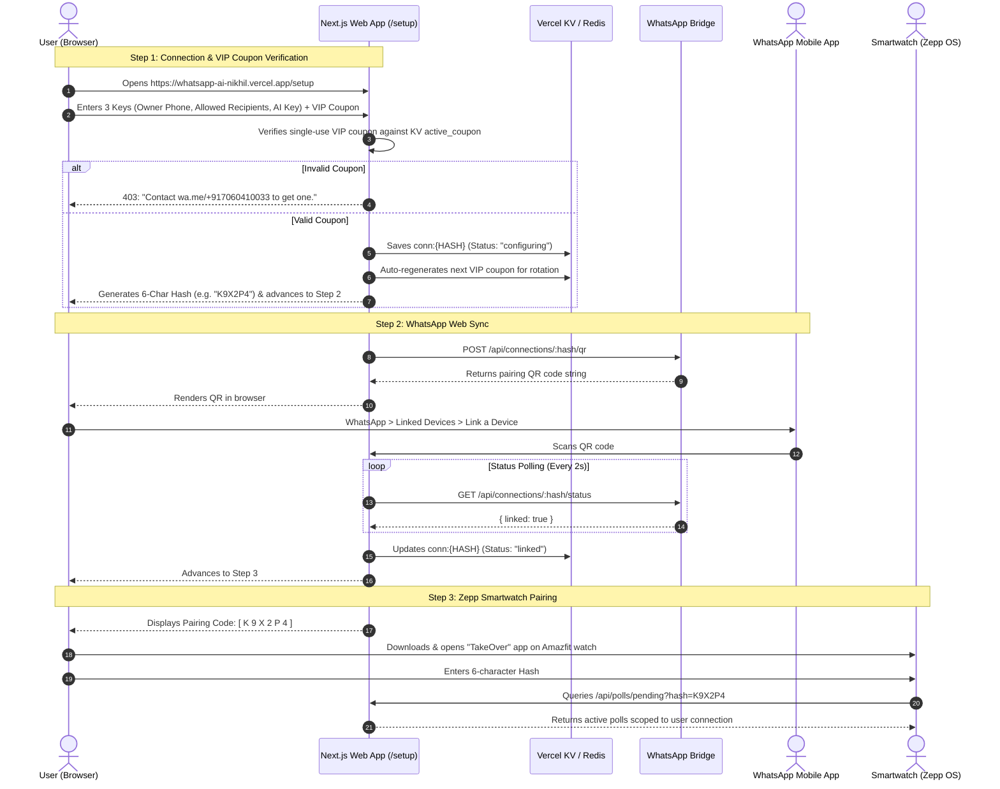

# Connection Setup & Smartwatch Onboarding Flow

This guide outlines the end-to-end user journey for setting up a connection, linking WhatsApp, pairing a Zepp OS smartwatch, and accessing the Superadmin control plane.

---

## Overview of the Flow

---

## Step-by-Step Breakdown

### Step 1: Setting up Connection Details

Users visit the web setup portal (`/setup`) and submit the following required values:

1. **`OWNER_PHONE`**: The owner's WhatsApp number (country code, no symbols, e.g. `917060410033`). Receives WhatsApp polls and notifications.
2. **`ALLOWED_RECIPIENTS`**: Comma-separated list of contacts the AI is allowed to interact with.
3. **`AI_API_KEY`**: API key for LLM generation (e.g. OpenRouter, OpenAI, Groq, or Google Gemini).
4. **`COUPON`**: An active VIP registration coupon (e.g., `VIP-XXXX`).
   * If the coupon is invalid or missing, the interface prompts the user:
   * *"Invalid coupon. Contact [wa.me/+917060410033](https://wa.me/+917060410033) to get one."*

Upon successful validation, the backend generates an unambiguous 6-character hash (e.g. `K9X2P4`) using the uppercase base-32 alphabet (`ABCDEFGHJKLMNPQRSTUVWXYZ23456789`), registers the connection, and auto-rotates the VIP coupon in KV.

---

### Step 2: WhatsApp Web Multi-Device Pairing

1. The frontend initiates a QR provisioning request to `POST /api/connections/:hash/qr`.
2. The Go Bridge generates a WhatsApp Web pairing session and returns the QR code string.
3. The user opens WhatsApp on their mobile phone:
   * Navigate to **Settings** -> **Linked Devices** -> **Link a Device**.
   * Scan the QR code displayed on the screen.
4. The web app polls `GET /api/connections/:hash/status` every 2 seconds until the device authentication handshake is finalized.

---

### Step 3: Smartwatch Pairing via Zepp OS

1. The web setup screen confirms the link and prominently presents the **6-character hash**.
2. The user installs the **TakeOver** application on their Amazfit smartwatch via the Zepp App.
3. In the Zepp App / Watch Settings:
   * Enter the 6-character hash code.
4. The watch companion service stores the hash locally and scopes all poll queries and vote dispatches to that user's session:
   * `GET /api/polls/pending?hash=K9X2P4`
   * `POST /api/polls/:id { option: "5 minutes", source: "watch", hash: "K9X2P4" }`

---

### Step 4: Web Dashboard Login & WhatsApp OTP Verification

When accessing or switching connections on the Web Take-Over Panel (`https://whatsapp-ai-nikhil.vercel.app/`):

1. **Step 1: Enter Connection Code**: The user provides the 6-character connection hash (e.g., `K9X2P4`).
2. **Step 2: WhatsApp OTP Dispatch**: The backend immediately generates a secure 6-digit OTP (10-minute expiration) and dispatches it directly to the owner's WhatsApp phone number registered to that connection.
3. **Step 3: OTP Verification**: The user inputs the 6-digit code received on their phone.
4. **Step 4: Authenticated Session**: Upon successful verification, the server issues a signed HS256 JWT session cookie (valid for 30 days), unlocking the live Take-Over dashboard.

---

### Step 5: Superadmin Management & Oversight (`/superadmin`)

System administrators access `/superadmin` to oversee global operations:

1. **2FA Superadmin Login**: Master secret verified in constant time + optional WhatsApp 2FA OTP sent to `SUPERADMIN_PHONE`.
2. **Global Telemetry**: Real-time storage footprint (bytes used per tenant), message volume counters, and bridge socket health.
3. **Tenant Operations**: Remotely trigger socket reconnects, disconnects, or permanent tenant wipes.
4. **VIP Coupon Control**: Generate, copy, or assign custom registration coupon codes.

---

## Security & Session Scoping

* **Two-Factor WhatsApp OTP Protection**: Merely knowing the 6-character connection hash is insufficient to access the dashboard. A 6-digit one-time password delivered via WhatsApp to the registered owner's phone is required for every login and connection switch.
* **Superadmin 2FA & Rate Limiting**: Master administration requires two-factor authentication and locks out brute-force attempts after 5 failures.
* **No Plaintext API Keys on Devices**: The AI API key and sensitive credentials remain secured in the server-side KV store. The watch only requires the public session hash.
* **Granular Whitelist Enforcement**: The controller strictly verifies incoming chats against `ALLOWED_RECIPIENTS` registered to the connection.
* **Instant Revocation**: If the owner texts the contact manually from WhatsApp, the grant is instantly invalidated across all platforms (WhatsApp, Web, Watch).

